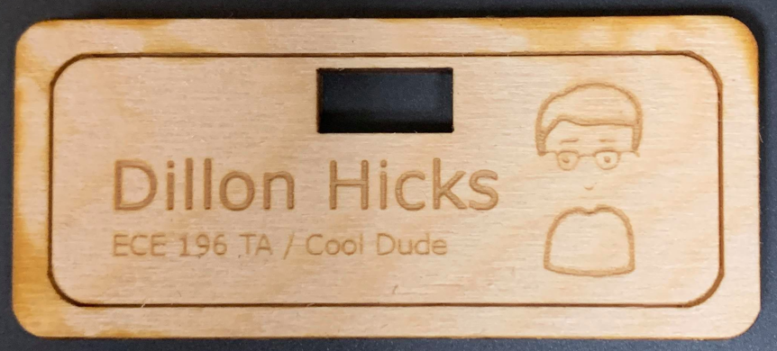
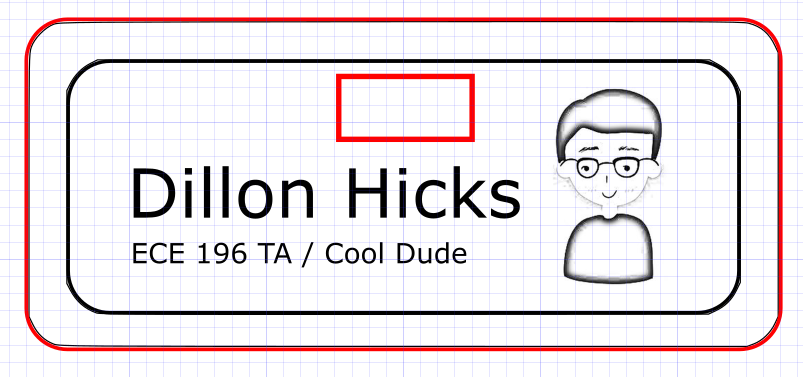

_Written by Dillon Hicks_

## Laser Cutting Introduction

<iframe width="1520" height="545" src="https://www.youtube.com/embed/UbvfiTLGk6M" title="YouTube video player" frameborder="0" allow="accelerometer; autoplay; clipboard-write; encrypted-media; gyroscope; picture-in-picture" allowfullscreen></iframe>

## Laser Cutting Assignment

<iframe width="1520" height="545" src="https://www.youtube.com/embed/Xppg6RavOek" title="YouTube video player" frameborder="0" allow="accelerometer; autoplay; clipboard-write; encrypted-media; gyroscope; picture-in-picture" allowfullscreen></iframe>

!!! question
    *Laser Cutting Assignment - Nametag and Box*

    ### Makerspace Quiz
    **1. [Complete the ECE Makespace Laser Cutting Quiz](https://docs.google.com/forms/d/e/1FAIpQLSdbgVLiAy8XnOwxBwCNafs6U3YtXoes3YUAkSqij5sYDo6VAQ/viewform)** (You will be unable to laser cut your parts below if you do not complete this quiz)

    **1.5. If you are unfamiliar with designing lasercut parts, please follow this [Inkscape tutorial](https://a769067b-fd2e-40d8-ae55-e3f5228539cd.filesusr.com/ugd/c83f2c_5f87fb91f03648a38bc456c6e329dbc9.pdf)**

    ### Nametag

    **2. Create a cool lasercut nametag so we can learn each other's names quicker! **

    The nametag must be:

    - At least 2.5 inches across
    - Rounded Edges
    - .5 x .25 in hole for badge clip (we will provide the badge clip after your nametag is cut)
    - The following needs to be engraved:
        * Your Name + some other text
        * An engraved image/shape/cool design
        * Engraved border 
    
    | Design Example | Cut Example |
    |:--------------:|:-----------:|
    | |  |

    ### Box

    **3. In order to keep your nametag safe in your backpack, also design a box to hold your nametag.**

    This box must be constructed using one of the following:

    - Finger joint
    - Mortise and Tenon joint
    - T-slot joint

    **Note that our materials used in the makerspace are either 0.25 inches or 0.125 inches in thickness, so use this information to design your nametag and box.**

    **Submit both of these designs in .svg format and ensure that your design meets all of these requirements! The nametag must be cut in the makerspace as well, the box does not.** 

    *WI22 Note: Since we are unable to cut this in the first two weeks, we will cut the nametag when we are able to return in the makerspace. The design is still due by the due date mentioned in class*
    

