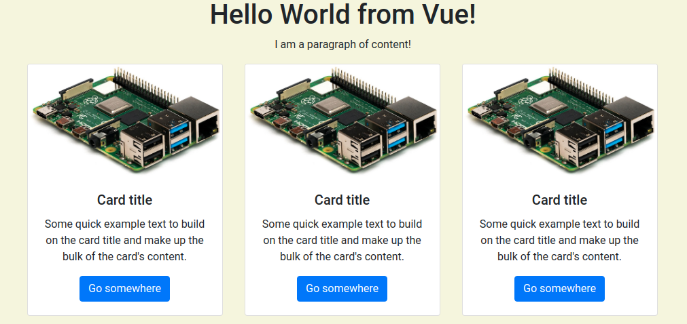

# Intro to Bootstrap
_Written by Curtis Lee_

## Intro to Bootstrap

At this point you may have noticed our website overall still looks pretty unattractive. We could write more CSS from scratch to make our website look exactly how we want, but in most cases that's a waste of time. Instead, we can use another framework for CSS called Bootstrap. 

Bootstrap basically gives us a complete CSS stylesheet with designs for all the common UI elements to use in our app, including page layouts, fonts, buttons, textboxes, etc.

!!! info "Read More"
    Here we only briefly explore a small feature set of Bootstrap. 
    
    It is recommended to browse the [documentation](https://getbootstrap.com/docs/4.5/getting-started/introduction/) to see all it has to offer.

### Adding Bootstrap

Similarly to including JavaScript, we can include CSS stylesheets before our existing `<style>` element like this:

    <link rel="stylesheet" href="https://stackpath.bootstrapcdn.com/bootstrap/4.5.2/css/bootstrap.min.css">

When we refresh the page, we will immediately see the default font changed to a sans-serif type, the default for Bootstrap.

To assign HTML tags style definitions from CSS, we add `class` attributes.

### Grid System

Bootstrap's approach to page layout is a dynamic grid system. We can utilize this to improve the layout of the page. Here is an example of a basic 3 column layout:

    

        

            

                One of three columns
            

            

                One of three columns
            

            

                One of three columns
            

        

    

One possible implementation on our page:

!!! info "Read More"
    To better see how this grids and containers system works, check out the [official example](https://getbootstrap.com/docs/4.5/examples/grid/). Try resizing the window and see how the elements react!

### Margins

Margins are useful to put set amounts of space between different elements.

Margins can be specified with `class` attributes with a letter `m` for margin, another letter for the direction, and number for size:

* `class="mt-5"` puts a margin on top of size 5
* `class="ml-2"` puts margin on the left of size 2

Combined margins:

* `class="mr-5 mb-5"` will put a margin on both right and bottom of size 5
* `class="m-5"` will put a margin on all sides of size 5

We can wrap our page title in a 1x1 container and give it some margin from the top of the page like this:

    
 
        

                

                <h1 id="title">{{ titleText }}</h2>
                
I am a paragraph of content!

            

        

    

### Cards

Cards are an all-purpose way to hold content. Different types of content can also be mix and matched in a card. Here is an example of a basic card:

    

        
            
            

                <h5 class="card-title">Device: Raspberry Pi</h5>
                
The Raspberry Pi is awesome!

                <a href="https://www.raspberrypi.org/" class="btn btn-primary">Learn More</a>
            

        

    

Combining cards with layouts we could create this: 

### Tables

To improve our display of the "Selected Values", we can convert it into a Bootstrap table. Creating a table can first be done with HTML tags like this:

    <table class="table">
        <thead class=".thead-light">
            <tr>
                <th scope="col">Type</th>
                <th scope="col">Color</th>
                <th scope="col">On</th>
            </tr>
        </thead>
        <tbody>
            <tr>
                <td>
                    
                </td> 
                <td>Red</td> 
                <td>
                    <input type="checkbox" v-model="color.r" v-on:change="updateColor()">
                </td>
            </tr>
            <tr>
                <td>
                    
                </td> 
                <td>Green</td> 
                <td>
                    <input type="checkbox" v-model="color.g" v-on:change="updateColor()">
                </td>
            </tr>
            <tr>
                <td>
                    
                </td> 
                <td>Blue</td> 
                <td>
                    <input type="checkbox" v-model="color.b" v-on:change="updateColor()">
                </td>
            </tr>
        </tbody>
    </table>

!!! info
    Lists or tabular data of large or arbitrary sizes should be generated using the `v-for` directive (akin to a `for` loop), but since we aren't using any we won't go over it in this course.

Also, to get the icons to display properly, add this class to our custom `<style>` block:

    .icon {
        width: 2em;
        height: 2em;
    }

Adding the table to one of the cards shown previously could look like this:

### Buttons

Bootstrap also give us templates for buttons, as well as "button groups" which can combine adjacent buttons into a single bar.

    

        <button v-on:click="selectAll(true); updateColor();" type="button" class="btn btn-secondary">Select All</button>
        <button v-on:click="selectAll(false); updateColor();" type="button" class="btn btn-secondary">Deselect All</button>
    

### Lists

We can use Bootstrap List Groups on top of an HTML list to make our sensor data card look nice.

    <ul class="list-group">
        <li class="list-group-item">Temperature: 40C </li>
        <li class="list-group-item">Humidity: 50%</li>
    </ul>

### Final Touches

To make all the cards the same height we can add `d-flex` to each column `
`, and then add `w-100` to each card `
` so that the fill the column properly, like this:

        ...
        

            

                ...

!!! info
    Fine tuning layout specifics can get very time consuming so we won't go over too many tricky details.

Also replacing the checkboxes with toggle switches are a nice touch:

    

        <input v-model="color.r" type="checkbox" class="custom-control-input" id="color-r">
        <label class="custom-control-label" for="color-r"></label>
    

    

        <input v-model="color.g" type="checkbox" class="custom-control-input" id="color-g">
        <label class="custom-control-label" for="color-g"></label>
    

    
    

        <input v-model="color.b" type="checkbox" class="custom-control-input" id="color-b">
        <label class="custom-control-label" for="color-b"></label>
    

Finally, its a good idea to associate color with each entry on the LED table with some inline `style` attributes:

    style="background-color: lightcoral;"

    style="background-color: lightgreen;"

    style="background-color: lightskyblue;"

Here is what the final result can look like:

## Data Visualization Methods

We are able acquire tons of data with our DHT22 sensor, and potentially other sensor modules, however, currently they are not being recorded or visualized over time.

We can create more advanced views of our data with yet another JavaScript framework called [**Chart.js**](https://www.chartjs.org/). With Chart.js we can create good looking and interactive [graphs of all types](https://www.chartjs.org/samples/latest/).

