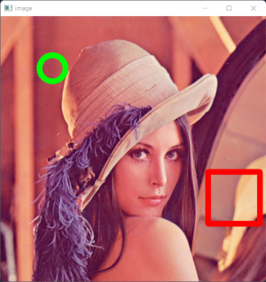
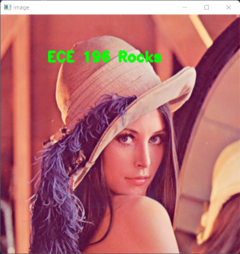
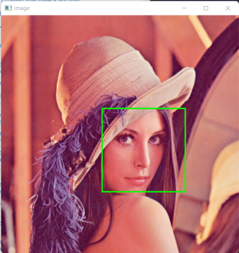
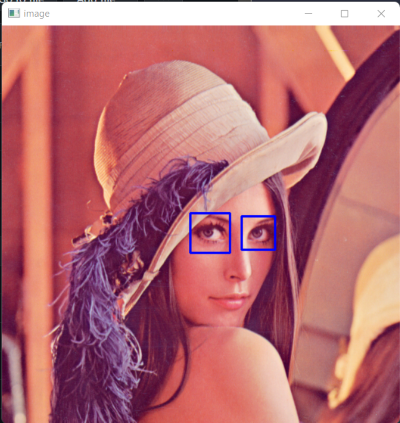
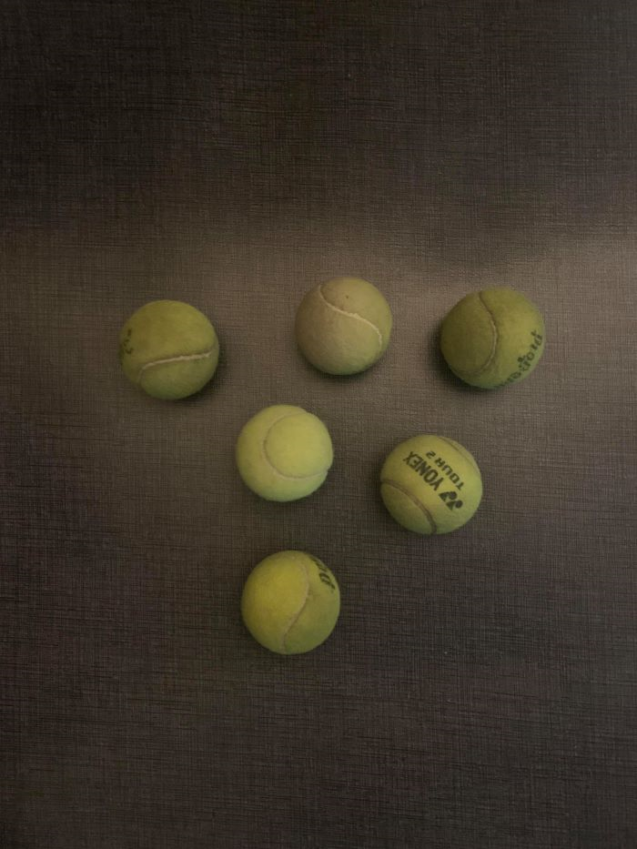
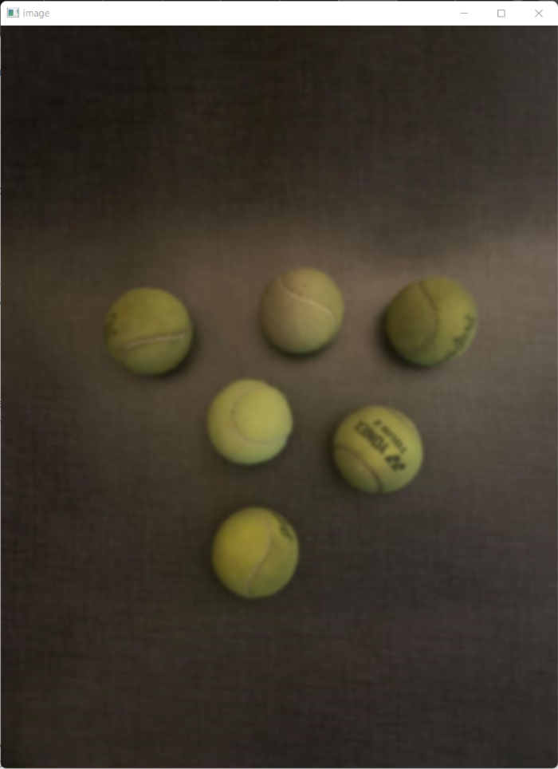
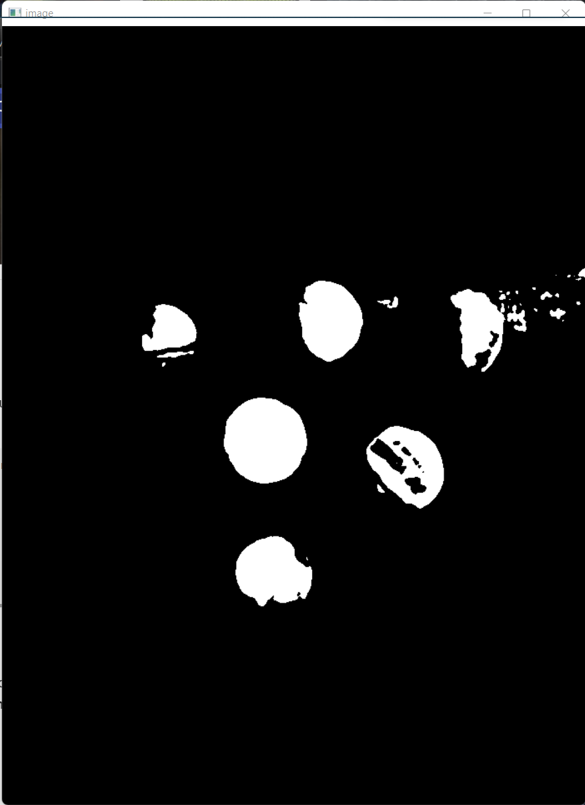
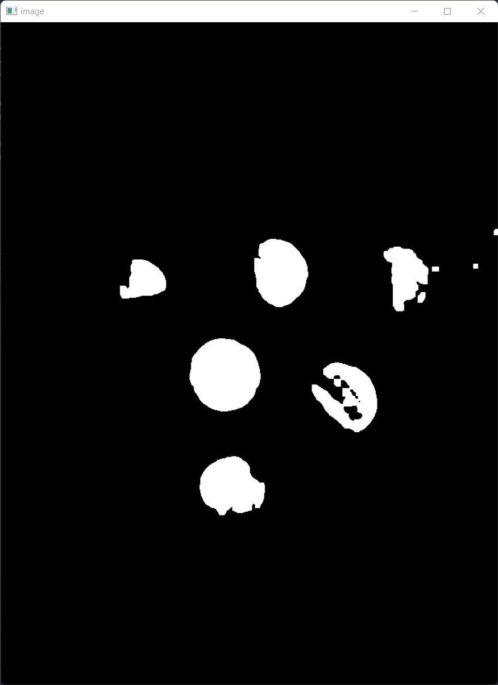
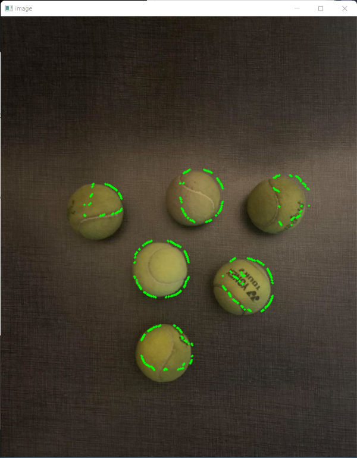
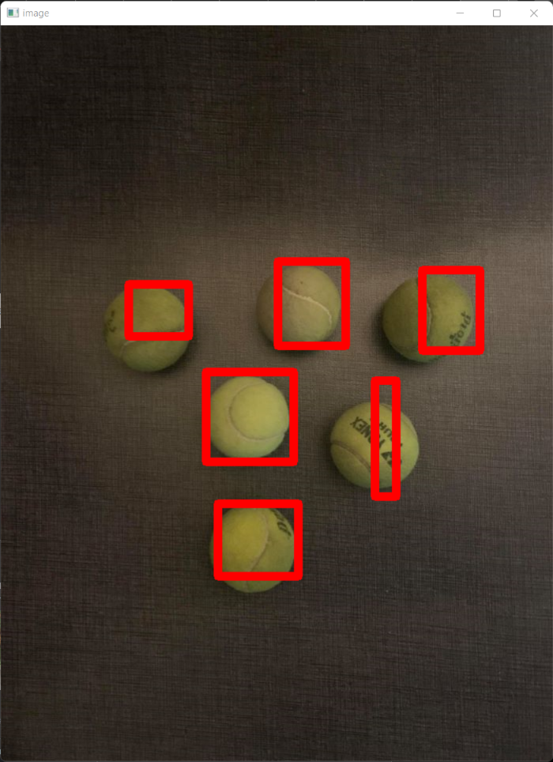

# ECE 196 Intro to OpenCV


*Written by Dillon Hicks*

!!! quote

    ***What is OpenCV?***  
    OpenCV is a library of programming functions mainly aimed at real-time computer vision (CV)


## Requirements

* Laptop with Anaconda installed and a webcam
* OR RPi with camera attached

## Slides


<iframe src="https://docs.google.com/presentation/d/1mdggvESBlnIzyURRJIF40dSzkuPSuwzPU3LYPiIM3JU/preview?slide=id.p&amp;usp=embed_facebook" frameborder="0" width="960" height="569" allowfullscreen="true" mozallowfullscreen="true" webkitallowfullscreen="true"></iframe>


## Setup

Before we get started, we need to set up all of the libraries necessary for this lecture. With your conda environment activated, install the necesary dependencies by typing the below coimmands into your terminal window.


**OpenCV**

`pip install opencv-contrib-python`

**imutils (image utility module from Adrian Rosebrock - https://www.pyimagesearch.com)**

`pip install imutils`

**NumPy (For efficient multi-dimensional python arrays)**

`pip install numpy`


To test these installations, create a new python script and run it with the following import statements:

```python
import cv2
import imutils
import numpy as np
```


!!! info
    When installing OpenCV from `pip`, we get the default version, which doesn't have many useful add-ons such as CUDA-acceleration (Nvidia GPU acceleration). We can compile OpenCV from directly from source, but  this installation takes a very long time (hours in many cases). However, compiling from source may be preferable when GPU acceleration is available to speed up processing times. 


## Operating on Images

The first obvious step for basic computer vision functions is opening single images. There are some functions that make this very easy to do.

For this guide we will use this sample image:


### Opening Images

You can read an image from you computer into python as a numpy array using `imread()`. We can then do any numpy operations that you could normally do on this array.

```python
#Loads an image with filename name into my_image

my_image = cv2.imread(name)
```


We can then open this image in a separate window using `imshow()`.

```python
#Opens a new window titled "Image", displaying my_image

cv2.imshow("Image", my_image)
```

You may then notice that it is a bit tough to close this window. To close this window easily, you can set a wait key using `waitKey()`, and close OpenCV windows using `destroyAllWindows()`. If this wait key is pressed, then the next line will run and  all windows will be destroyed (closed)

```python
#If q is pressed during x milliseconds wait time, close all opencv windows
x = 0
if cv2.waitKey(x) & 0xFF == ord('q'):
    cv2.destroyAllWindows()
```

!!! warning

    For WSL (Windows Subsystem for Linux), you may get errors when plotting using `imshow()` as GUI apps are not currently supported unless you are on the newest version of WSL and have the proper drivers installed. It is recomended that your native OS is used for compatibility with camera hardware.

    [Make sure you update WSL and the prerequisite drivers](https://docs.microsoft.com/en-us/windows/wsl/tutorials/gui-apps)


### Capturing Video

We can also create a video source as well for us to read videos from the onboard camera.

We can first make a video object using `VideoCapture()` from which to grab frames from at every iteration of a while loops using `read()`. Combining this with `imshow()` and other flow control functions, we can display images from our camera feed. 

```python
#The following recipe gets a numpy array at each iteration of the while loop
video = cv2.VideoCapture(0)

while True:
    ret, frame = video.read()

    # Display the resulting frame
    cv2.imshow('image', frame)
    if cv2.waitKey(1) & 0xFF == ord('q'):
        break

cv2.destroyAllWindows()

```


!!! warning

    If you try to run the code above on a RPi using the RPi camera, it will not work by default. Make sure to enable the camera by following the following steps:

    1. [Enable the camera using `sudo-raspi-config`](https://geek-university.com/raspberry-pi/enable-camera-in-raspi-config/)
    2. Install picamera using `pip install "picamera[array]"` and use the picamera functions for reading pictures

    [For a more detailed tutorial, use this link](https://www.pyimagesearch.com/2015/03/30/accessing-the-raspberry-pi-camera-with-opencv-and-python/)

### Drawing on images

In addition, you can also resize an image to more easily display it, or reduce computation time for smaller images. From Adrian Rosebrock's library imutils, we can resize an image to a width of `pixels` with

```python
pixels = 360
imutils.resize(my_image, pixels)
```

In addition, we can also place shapes onto images using several built in functions. Below, we use the `circle()` and `rectangle()` functions, but many more are available in this [OpenCV documentation](https://opencv-tutorial.readthedocs.io/en/latest/draw/draw.html)


```python
#places a green circle at (100,100) with r = 25 with a thickness of 10 pixels
cv2.circle(my_image, (100,100), 25, (0,255,0), 10)
cv2.rectangle(my_image, (400,300), (500,400), (0,0,255), 10)
```



### Text

To add more information to images, we can also add text. This is fairly easy to do as we can simply get a font built into OpenCV, and `putText()` to place a given string at a location.

```python
font = cv2.FONT_HERSHEY_DUPLEX
cv2.putText(frame, text_string, location, font, fontscale, color, thickness)
```

For example, for the below image, the code used was:
```python
font = cv2.FONT_HERSHEY_DUPLEX
cv2.putText(frame, "ECE 196 Rocks", (100,100), font, 1, (0,255,0), 3)
```




!!! question

    **Exercise 1**


    Combine all of the following functions above to open an image and do some modifications to it!

    1. Open an image of your choice and show it in a window that you can close, 
    2. Resize the image to 900 pixels wide
    3. Draw a rectangle at the center of the image, and place a line of text above that square


## Facial Detection


Next up, let's go over basic **Facial Detection**. 

Facial detection is a fun task as it allows us to see if any faces are in our images. This is done using a [Haar Cascade Classifier](https://en.wikipedia.org/wiki/Viola%E2%80%93Jones_object_detection_framework). This works by making many small ML classifiers that are then *cascaded* together to detect small visual features, such as those in the image below, for certain objects. These features are shown below for facial detection. In this case, these Haar Cascade Classifiers are trained to detect faces, but these classifiers can detect many different types of objects. 


Since we aren't worrying about ML portions in this lecture, we won't go too in to detail, but OpenCV allows us to implement these algorithms without knowing anything about ML to accomplish cool tasks!

First, let's look at what XMLs built in to OpenCV can be used to detect faces. 

[HAAR CASCADE XMLS](https://github.com/opencv/opencv/tree/master/data/haarcascades) 

!!! note
    From the above Github link, you may notice that there are many different trained models for different detection tasks. You can interchange these XMLs to accomplish many tasks, including body, eye, and face detection.


```python
faceCascade = cv2.CascadeClassifier(cv2.data.haarcascades + 'haarcascade_frontalface_alt2.xml')
```

Once we load the cascade classifier, we can then detect the faces, which are returned from the `detectMultiScale` function, from which we can get the top left corner and width and height of the bounding box around each detected object.


```python 
faces = faceCascade.detectMultiScale(frame)
for (x, y, w, h) in faces:
    #do something
```

!!! question

    **Exercise 2**

    Now it's time to do some cooler things! 

    * From your video source, detect the faces in each frame and place a rectangle around each face. Test that this works by detecting your face in your video.

    Hint: use `cv2.rectangle` and use the `w`, and `h`, the width and height, respectively, to offset the rectangle from the top corner. i.e. (x+w,y+h)

    If you have extra time, try to use some of the other Haar classifiers to detect different objects!





## Image Processing

Although facial detection is an easy task to do with OpenCV, not all tasks are as straightforward. One task that is essential to any computer vision workflow is **Image Processing**.

We process our images for one main reason, to make them easier for our algorithms we develop to analyze. One main way we can do this is to remove **Noise**. Noise is essentially unwanted data in our images, and this noise can greatly affect how our algorithms perform. Thus, it is essential to reduce the amount of noise in our images. 


### Blur

One important way to remove noise is **Blurring**. Standard intuition may tell you that blurring an image makes it worse, which to the naked eye, is true! However, the human brain is made to ignore small bits of noise in images, but computers **are not**. Blurring can get rid of small details that are ultimately unnecessary to the performance of our algorithms, limiting the ability of small details to "trick" our algorithms.

One common blurring algorithm is the Gaussian Blur, which we will use in this lecture to "smooth" our image.

For other blurring algorithms, feel free to check out [this tutorial by Adrian Rosebrock](https://www.pyimagesearch.com/2021/04/28/opencv-smoothing-and-blurring/)

```python
#applied a gaussian blur with a standard deviation of 11
frame = cv2.GaussianBlur(frame, (11, 11), 0)
```

Unblurred Image           |  Blurred Image
:-------------------------:|:-------------------------:
  |  


### Thresholding

Thresholding can be used to create a mask


We can also set an upper and lower boundary for our threshold. Thus, the output mask would be 0 if it is outside these lower and upper bounds, and 1 otherwise

```python
# Tuple containing 2 lists of BGR pixel values denoting minimum and maximum example red values
boundaries = ([17, 17, 150], [125, 125, 255])

# Setting lower and upper bounds
lower = np.array(boundaries[0], dtype = "uint8")
upper = np.array(boundaries[1], dtype = "uint8")

# Transforms the above boundaries into numpy arrays
mask = cv2.inRange(frame, lower, upper)
```

    


### Morpological Transformations

Once we convert our images to masks, our ability to remove noise doesn't stop there, we can use **Morpological Transformations**, most notably, **Erosions** and **Dilations** to further remove noise in our mask. 

Original Image           |  Dilated Image              |  Eroded Image
:-------------------------:|:-------------------------:|:-------------------------:
  |   |  


These morphological transformations work to change the images shape. They can remove noise, and further highlight useful features in our images.

There are many other morphological Transformations available - [see here](https://opencv24-python-tutorials.readthedocs.io/en/latest/py_tutorials/py_imgproc/py_morphological_ops/py_morphological_ops.html).

We can apply these transformations to our mask with the following code.

```python
#Applies an erosion, followed by a dilation with 3 iterations each (the more iterations, the stronger the transformation)

mask = cv2.erode(mask, None, iterations=3)
mask = cv2.dilate(mask, None, iterations=3)

```

Mask without Morpological Transformations |  Mask with Morpological Transformations
:-------------------------:|:-------------------------:
  |  


### Contour Detection


From the mask, we can get the contours of the mask, or the boundary of each masked object. 

```python 
contours = cv2.findContours(mask.copy(), cv2.RETR_EXTERNAL,cv2.CHAIN_APPROX_SIMPLE)
contours = imutils.grab_contours(contours)

for contour in contours: 
    cv2.drawContours(frame, contour, -1, (0,255,0), 3)
```




Next, using `minAreaRect()`, we can get the minimum area rectangle that covers the contours.


```python
rect = cv2.minAreaRect(contour)
box = cv2.boxPoints(rect)
box = np.int0(box)
```

!!! question

    **Exercise 3**

    Take the following image and detect the tennis balls!

    

    1. Apply a blur to the image
    2. Threshold the image.
    3. Erode, then dialte the image
    4. Plot a box around each tennis ball

    Extra: Experiment more with the thresholds and try it on a video! (Ask Dillon for a tennis ball)


Original Image           |  Detected Tennis Balls
:-------------------------:|:-------------------------:
  |  
