# Intro to Raspberry Pi
_Written by Curtis Lee, pictures by Ravi Patel_

!!! note "Recommended Reading"
    Please read the [Vilros Quick Start Guide](https://cdn.shopify.com/s/files/1/0195/1344/2404/files/QUICKSTART_09_06_2017_EDITION.pdf?4444633349731588961) (included with the Raspberry Pi kit) up to section 2.5 (and skip 2.3).

    Then you can skip to [Pi Configuration](#pi-configuration).

## Slides
<iframe src="https://docs.google.com/presentation/d/e/2PACX-1vSoRq0_4oykLQq-9eKQqJ7qEyALr3dmPlo7-Wr0yri2f_C1NOXQqm9THRSnRA_cuevilfTwMNq0sx5a/embed?start=false&loop=false&delayms=3000" frameborder="0" width="960" height="569" allowfullscreen="true" mozallowfullscreen="true" webkitallowfullscreen="true"></iframe>

## What is Raspberry Pi?

!!! quote
    The Raspberry Pi is a low cost, credit-card sized computer.

* Raspberry Pi is a [product line](https://www.raspberrypi.org/products/) of single-board computers aimed at hobbyists and students.
* Small form factor, low cost, and ease-of-use
* CPU is ARM based, similar to those found in smartphones.
* Has USB, HDMI and network connectivity like other computers. 
* but also GPIOs like a microcontroller.

All these characteristics means it's suitable for a wide range of embedded uses!

## Raspberry Pi Setup

### Hardware Checklist
1. [Raspberry Pi](https://vilros.com/collections/raspberry-pi-kits/products/vilros-raspberry-pi-4-complete-desktop-kit-with-keyboard-and-mouse)
   1. 5V, 2.5A Micro USB Power Supply (for Pi)
   2. MicroSD Card with NOOBS preloaded
   3. Keyboard & Mouse
2. [HDMI Monitor](https://www.amazon.com/SunFounder-Raspberry-Display-Portable-1920x1080/dp/B07NNXH2SS)
   1. 12V, 200 mA Power Supply (for Monitor)
   4. HDMI Cable
3. Hardware Kit
   1. [DHT Sensor](https://www.adafruit.com/product/385)
   2. LEDs, Resistors, Buttons, etc

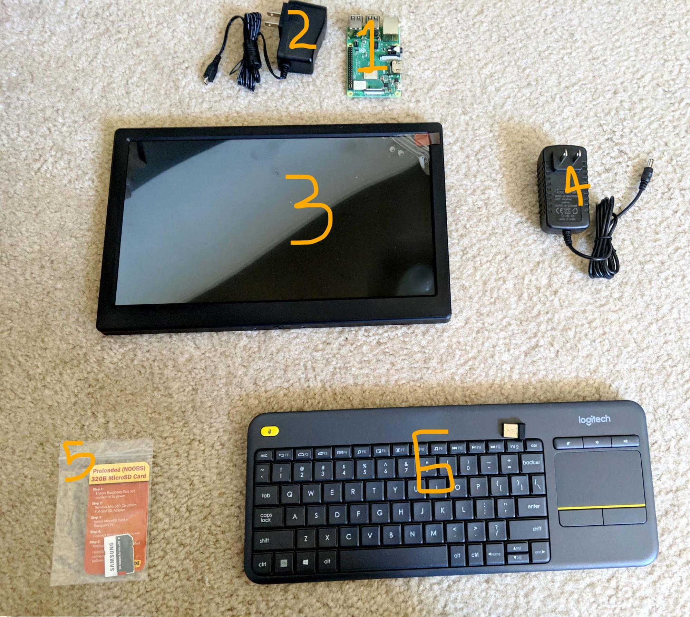

### Hardware Setup

1. Connect the HDMI monitor to the 12V, 200mA power supply
  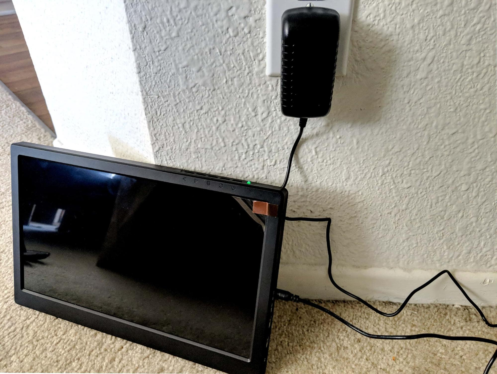
2. Insert the MicroSD Card into the Raspberry Pi
  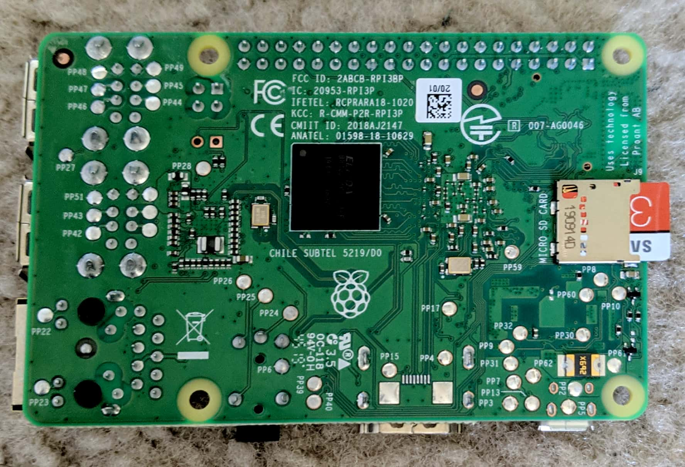
3. Before powering the Raspberry Pi, connect it to the HDMI monitor via the HMDI cable 
  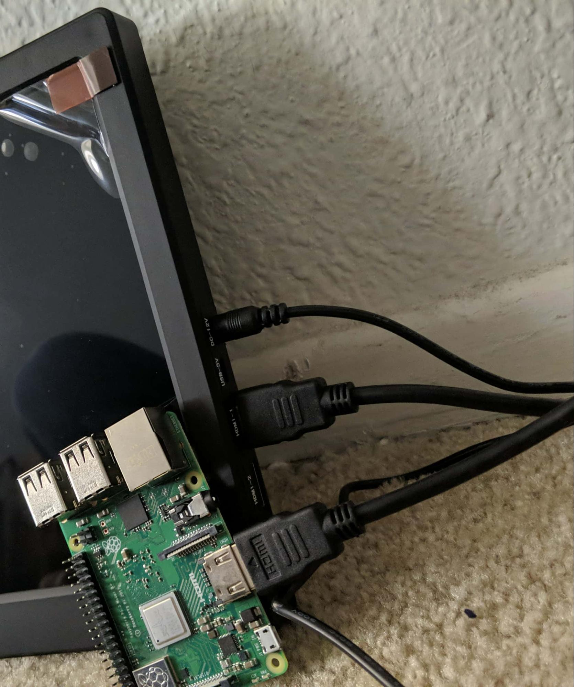
4. Connect the 5V, 2.5A power supply to the Raspberry Pi to power it on
  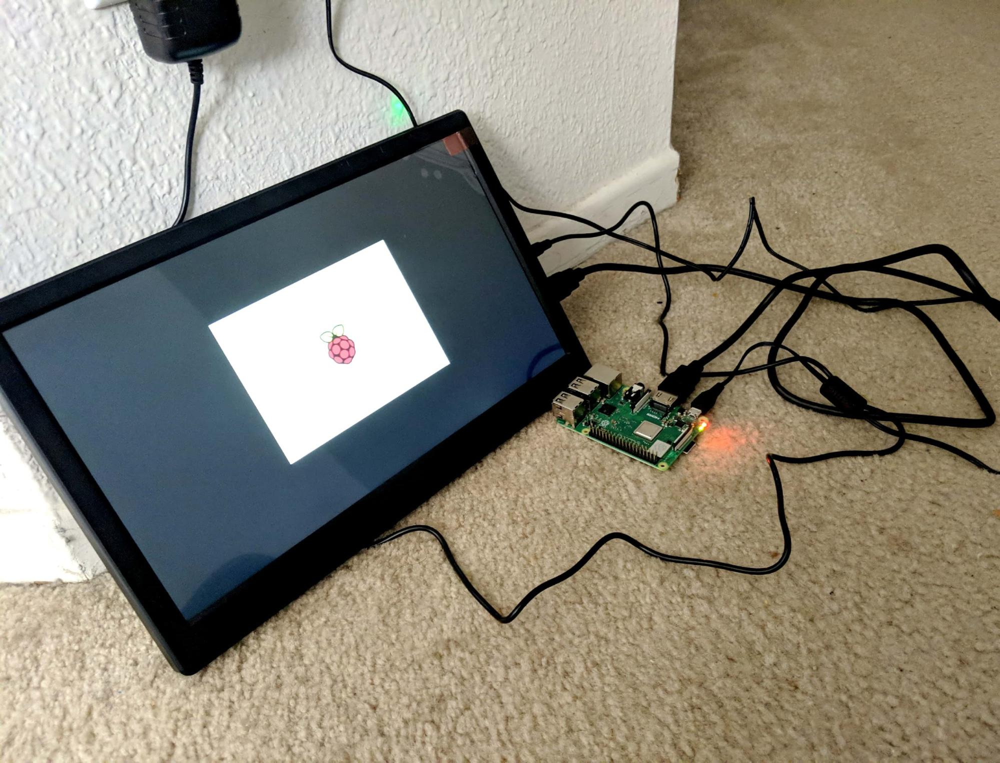
5. To start using the keyboard, simply insert the USB dongle into the Raspberry Pi and turn on the keyboard

### OS Setup

!!! info
    There are [many OS's](https://www.makeuseof.com/tag/raspberry-pi-operating-systems-not-linux/) for the Raspberry Pi, but we'll be using is called [Raspbian](https://www.raspberrypi.org/downloads/raspberry-pi-os/).

    The Raspberry Pi kit should come with an SD card with [NOOBS](https://www.raspberrypi.org/documentation/installation/noobs.md) preinstalled. NOOBS allows you start the Pi out-of-the-box and install Raspbian with an internet connection. 

    If for some reason the card is empty or corrupted we can also [manually flash Raspbian](https://www.raspberrypi.org/documentation/installation/installing-images/).

1. Once the RPi boots up, the monitor should show a welcome message. Click Next.
2. Raspberry Pi will request you to select the Country, Language, and Timezone. Select the appropriate setting. If you’re using the US Keyboard, make sure to check the box for US Keyboard. Click Next.
3. The default ‘pi’ user account currently has the password ‘raspberry’. Now is a time to change the password. Once done, click Next.
4. On the next screen, check the box if there is a black border around the desktop. Click Next.
5. Select the WiFi network that you wish to connect with. Note: WiFi will be required for this project. Once connected, proceed to the next step.
6. Once connected to WiFi, RPi will be requesting a software update. Click Next to update software. If there are any errors with the updates, skip this step.
7. Once all the configuration is set up, restart the raspberry pi.

### Pi Configuration
1. Click on the application menu on the top left. Go to Preferences and open up Raspberry Pi Configuration.
  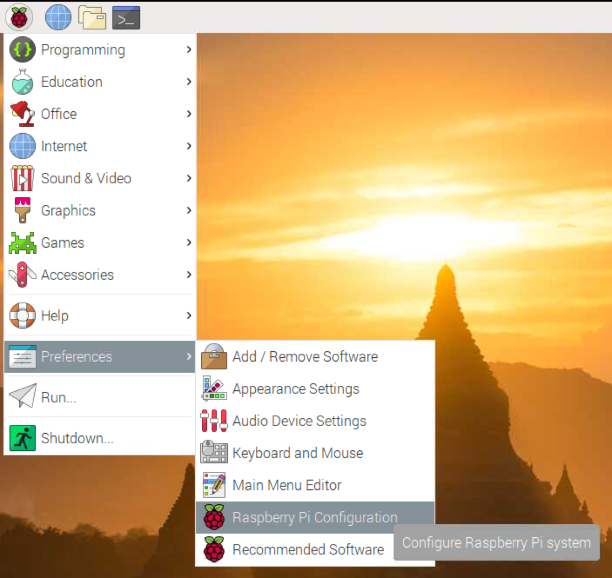
2. Now if the time to change any login credentials, if desired. 
  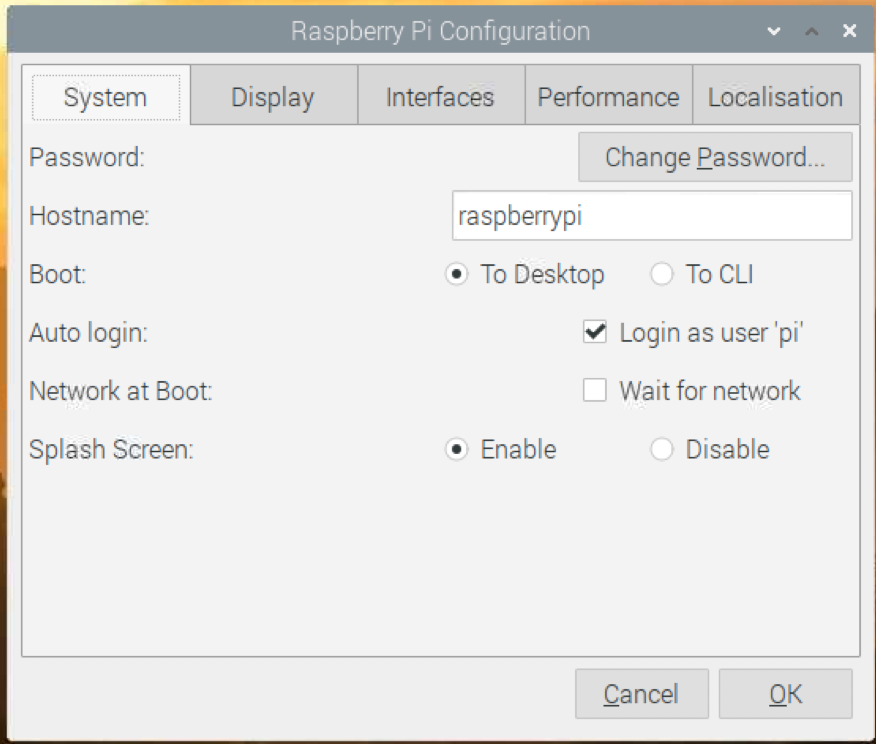
3. Go to Interface and enable SSH and VNC. 
  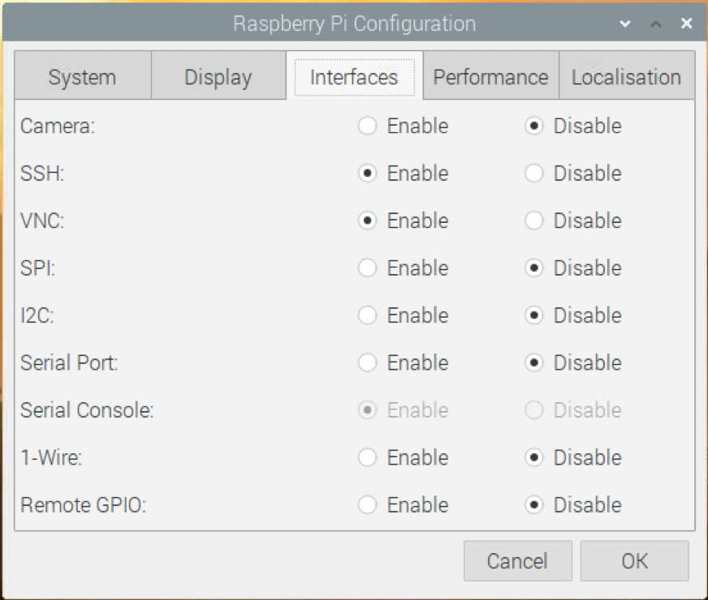


### Software Setup

Run the following commands in the Terminal app: 

1. Double check for updates:

        sudo apt update
        sudo apt upgrade -y

    If all the software was already updated sucessfully in the previous step, then this should quickly report that everything is up to date. Otherwise, **it could take a very long time**, depending on how many packages need to be updated.

2. Install library firebase-admin: 

        pip3 install firebase-admin

3. Install some libraries for the DHT22 sensor:

        pip3 install adafruit-circuitpython-dht
        sudo apt-get install libgpiod2

## Access Pi from PC

There are also various ways we can access a terminal, copy files, or even control the entire desktop from a computer connected to the same network.

Technically **this section is not necessary**. But at this point, it may be worth investing time into figuring out, especially if switching back and forth between the two devices is cumbersome.

### SSH

With SSH you can remotely open a terminal to the Pi from the comfort of your main computer.

To find the IP address, on your Raspberry Pi run following terminal command:

    ip addr

And look for the IP address listed under `wlan0` or `eth0`, depending on how you are connected.

   * If you have Mac/Linux, `ssh` should be built-in. 
   * If you have Windows, you need to install Git for Windows. Alternatively you can [use PuTTY](https://www.chiark.greenend.org.uk/~sgtatham/putty/latest.html) intead of `ssh`.
  
On your computer, use the `ssh` command followed by `username@ip_address`. 
    
For example, if the IP address is `192.168.0.100`:

    ssh pi@192.168.0.100


Read more about [using SSH](https://www.raspberrypi.org/documentation/remote-access/ssh/unix.md) and [using PuTTY](https://www.raspberrypi.org/documentation/remote-access/ssh/windows.md) on the Raspberry Pi website.

### SCP

SCP stands for "secure copy". We can use it to copy files from another device on the network securely over an SSH connection. The syntax is similar to the normal unix `cp` command. 

 * If you have Mac/Linux, `scp` should be built-in. 
 * If you have Windows, you need to install Git for Windows. 
    Alternatively you can use [WinSCP](https://winscp.net/eng/index.php) instead of `scp`.

For example, to copy a file from your computer to the Raspberry Pi:

    scp mycode.py pi@192.168.0.100:/home/pi/

This will copy the file `mycode.py`, from the current directory on your computer, to the "pi" user home folder on the Raspberry Pi.
    
Read more about [using SCP here](https://kb.iu.edu/d/agye).

### VNC

With VNC you can also use the desktop and control the mouse+keyboard remotely.

To use VNC, [download VNC Viewer](https://www.realvnc.com/en/connect/download/viewer/) on your computer. 


Read more about [using VNC](https://www.raspberrypi.org/documentation/remote-access/vnc/) on the Raspberry Pi website.

## Using Hardware

### Pinouts

Refer to this pinout diagram for connections:
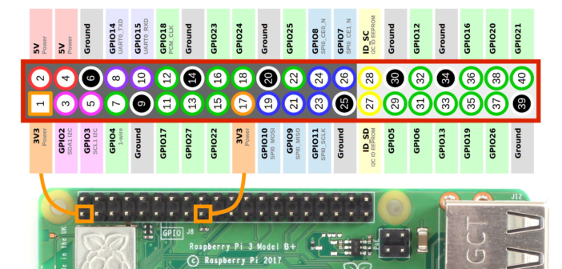

For more details about the pins and how to use them, read [this article](https://www.lifewire.com/tour-of-the-raspberry-pi-gpio-4063016).

### LED Hello World

The first thing we want to try is blinking an LED. This is the circuit equivalent of "Hello World".

Connect an **LED and resistor** in series to Pin 17:

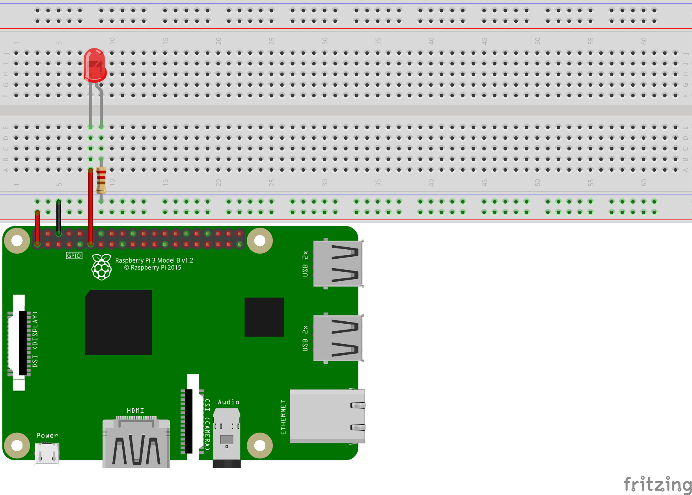

!!! warning
    Always use a resistor to limit the current on the LED to avoid burns! [See why here.](http://led.linear1.org/why-do-i-need-a-resistor-with-an-led/)

Now in your Pi's Home directory, create a new file called `blink.py` with this code:

    import RPi.GPIO as GPIO
    import time

    GPIO.setmode( GPIO.BCM  )
    GPIO.setwarnings( False )
    GPIO.setup( 17, GPIO.OUT )

    GPIO.output(  17, GPIO.HIGH )
    time.sleep( 1 )
    GPIO.output( 17, GPIO.LOW )

Save and run with Python in a terminal:

    python3 blink.py 

The LED should blink on for a second!

Now try changing the 3rd block to this:

    while True:
        GPIO.output( 17, GPIO.HIGH )
        time.sleep( 0.5 )
        GPIO.output( 17, GPIO.LOW )
        time.sleep( 0.5 )

The LED should blink on and off indefinitely every second!

!!! tip
    Press Ctrl+C in the running terminal to exit the Python script.

### RGB LED

An **RGB LED** is actually just 3 different color LEDs (red, green, blue) in a single package. With some combinination these colors we can also create secondary colors.

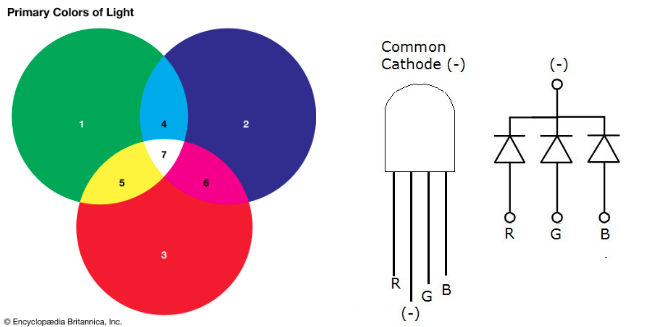

So to connect it to the Raspberry Pi, we can follow the same principle as before, but using 3 different pins.

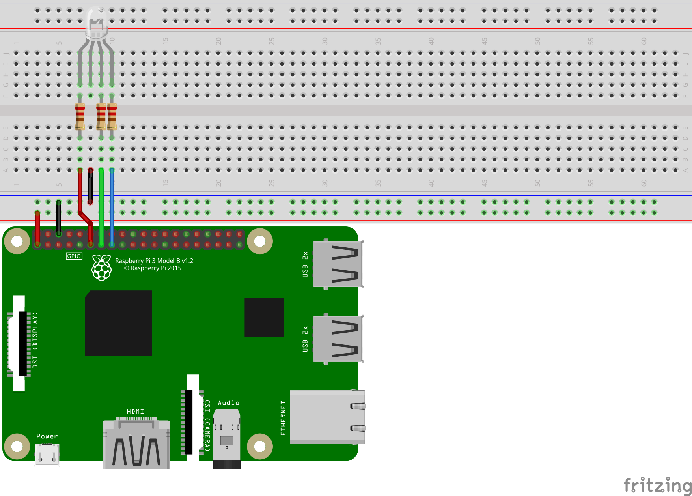

!!! warning
    We also need resistor on each of the 3 seperate color LEDS!

Now lets try blinking through some different colors:

    import RPi.GPIO as GPIO
    import time

    GPIO.setmode(GPIO.BCM)
    GPIO.setwarnings(False)

    RED_PIN = 17
    GREEN_PIN = 27
    BLUE_PIN = 22

    GPIO.setup(RED_PIN, GPIO.OUT)
    GPIO.setup(GREEN_PIN, GPIO.OUT)
    GPIO.setup(BLUE_PIN, GPIO.OUT)

    def blink( red,green,blue ):
        GPIO.output(RED_PIN,red)
        GPIO.output(GREEN_PIN,green)
        GPIO.output(BLUE_PIN,blue)

        time.sleep( 1 )
        GPIO.output(RED_PIN,GPIO.LOW)
        GPIO.output(GREEN_PIN,GPIO.LOW)
        GPIO.output(BLUE_PIN,GPIO.LOW)
        time.sleep( 1 )

    blink( GPIO.HIGH, GPIO.LOW, GPIO.LOW )    ## Red
    blink( GPIO.HIGH, GPIO.HIGH, GPIO.LOW )   ## Yellow
    blink( GPIO.LOW, GPIO.HIGH, GPIO.LOW )    ## Green
    blink( GPIO.LOW, GPIO.HIGH, GPIO.HIGH )   ## Cyan
    blink( GPIO.LOW, GPIO.LOW, GPIO.HIGH )    ## Blue
    blink( GPIO.HIGH, GPIO.LOW, GPIO.HIGH )   ## Magenta
    blink( GPIO.HIGH, GPIO.HIGH, GPIO.HIGH )  ## White

### DHT22 Sensor

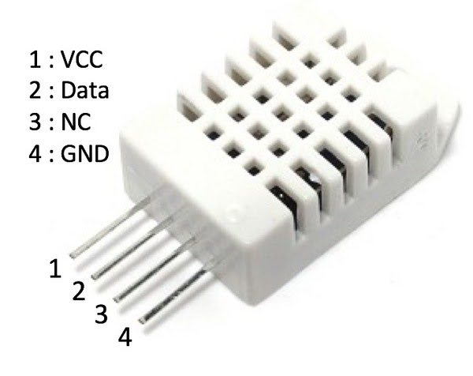

The [DHT sensors](https://learn.adafruit.com/dht) are humidity and temperature sensors. We are using the **DHT22**, but there is also a blue DHT11 sensor, which is a cheaper but less precise version.

We can connect it on a breadboard with a **10k resistor** like this:

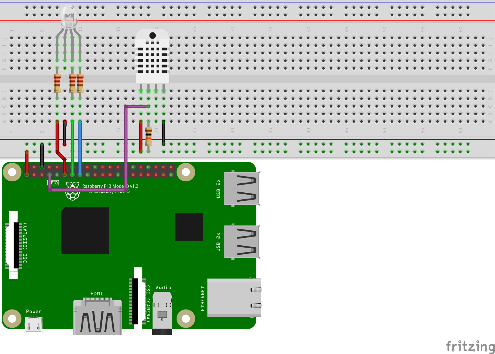

First, we need to open the terminal and install some libraries:

    pip3 install adafruit-circuitpython-dht
    sudo apt-get install libgpiod2

We also may need to reboot the Pi after installing if it doesn't work.

Now if we run this code:

    import adafruit_dht
    import board
    import time

    dht_pin = board.D4
    dht_sensor = adafruit_dht.DHT22(dht_pin, use_pulseio=False)

    temp_c = dht_sensor.temperature
    temp_f = temp_c * (9 / 5) + 32
    hum = dht_sensor.humidity
    print("Temperature =", temp_c, 'C,', temp_f, 'F')
    print("Humidity =", hum, '%')

It will read the sensor and print results. With a loop we can also make run indefinitely at a 10 sec interval like this:

    while True:
        temp_c = dht_sensor.temperature
        temp_f = temp_c * (9 / 5) + 32
        hum = dht_sensor.humidity
        print("Temperature =", temp_c, 'C,', temp_f, 'F')
        print("Humidity =", hum, '%')
        time.sleep( 2 )

!!! info
    We are initializing `dht_sensor` without pulseio API with `use_pulseio=False`. 

    In case you need to use pulseio and have some error with `libgpio_pulsein`, you may have to kill the existing process using that library.
    
    Try running this terminal command: `kill $(pgrep libgpio)`

### Buttons

To connect a button, we don't need external components as long as it's connected to an input pin with pullup enabled.


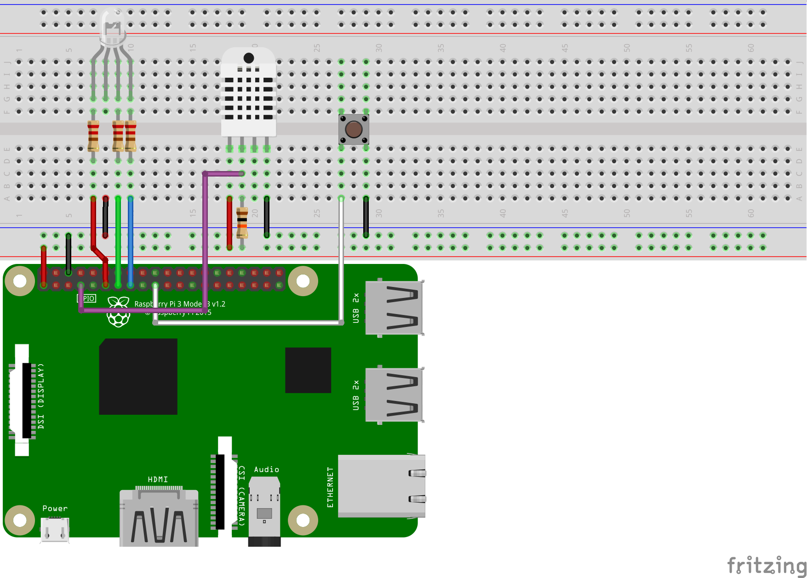

One way to incorporate the button in an event-based way:

    import RPi.GPIO as GPIO

    GPIO.setmode(GPIO.BCM)
    GPIO.setwarnings(False)
    GPIO.setup(10, GPIO.IN, pull_up_down=GPIO.PUD_UP)

    def callback_func(*args):
        print("Button was pushed!")

    GPIO.add_event_detect(10, edge=GPIO.FALLING, callback=callback_func, bouncetime=200)

    input("press enter 2 quit\n") # block program from exiting

Things to consider:
   
* Since the button is wired straight to **Ground**, we should enable the internal [**Pull Up** resistor](https://learn.sparkfun.com/tutorials/pull-up-resistors/all) and detect a **Falling Edge**.
* We need a [**debouncing**](https://www.allaboutcircuits.com/technical-articles/switch-bounce-how-to-deal-with-it/) time in the **milliseconds**.
* Adding an event callback means the **callback function** will run **asynchronously** from the main program execution. If there are no more code to run, we need to block execution or the entire script will just exit.
* `GPIO.cleanup()` can be used to resolved state errors.

### Serial/UART

The simplest way to communicate with an Arduino, BT module, and many external devices is to use serial. This process is the exact same as it would be on any generic Linux computer.

First, we need to find available serial ports by entering into the console:

    ls /dev/tty* 

A good trick to find the correct port USB serial devices is to run it before and after plugging it in.

Usually it will be `/dev/ttyUSB0` if it's the only one plugged in.

Here is an example to send a single byte from python script to the external device:

    import serial

    ser = serial.Serial('/dev/ttyUSB0', 9600, timeout=1)
    user_input = input("pls enter a byte:" )
    user_input = user_input.encode('utf_8')
    ser.write(user_input)
    line = ser.readline()
    print(line.decode('utf_8'))
    ser.close()

[Link to Examples from class](https://github.com/curtisrlee/ece196-fa21/tree/main/examples)


### More Hardware

There are nearly endless hardware components that you can use with the Raspberry Pi, including but not limited to the items in kit. If you would like to use other hardware components, here's some things to keep in mind:

* The Pi's GPIO's are all 3.3v based, and supply limited current only. 
    * To use 5.0v hardware, you may need a level shifter to prevent burning the pins.
    * To use high power components like motor, you will need an external power source, the Pi cannot supply enough power.
* To figure out how to use a new module, do research:
    * Check Pi tutorials, for popular components chances are that someone else has already figured it out.
    * Check Arduino tutorials, for the same reason.
    * Check datasheets/documentation for reference, but sometimes they can be very advanced.

!!! danger
    * Do not plug jumper wires directly into the wall outlet.
    * Do not plug jumper wires from the wall into the Pi.
    * Do not plug jumper wires from the wall into the breadboard.
    * Do not eat electronic components.

## Wifi Configuration

### UCSD-PROTECTED

If you want to connect to *UCSD-PROTECTED* or any of the *RESNET* networks, manual configuration is needed because they use WPA-Enterprise.

You can configure the Pi to connect to these network by editing a file with the following command:

```
sudo mousepad /etc/wpa_supplicant/wpa_supplicant.conf
```

And putting this template into the file:

```
ctrl_interface=DIR=/var/run/wpa_supplicant GROUP=netdev
update_config=1
country=US

network={
	ssid="UCSD-PROTECTED"
	scan_ssid=1
	key_mgmt=WPA-EAP
	eap=PEAP
	identity="YOUR UCSD USERNAME HERE"
	password="YOUR UCSD PASSWORD HERE"
	phase1="peapver=0"
	phase2="MSCHAPV2"
	disabled=1
}
```
* Replace `identity` and `password` with your information.

### More WiFi

* The Process for any *RESNET* network is the same as previous section, just copy and paste another `network` block and change the `ssid` to the proper *RESNET* wifi name.
* Same with *eduroam*, except *eduroam* requires full UCSD email for `identity`.

Additionally, you can add multiple `network` blocks into the configuration file. If you want to set up the Pi to automatically connect to another (standard WPA2) Wifi network (ie. at home) you can also add another block below it like this:

```
network={
    ssid="YOUR WIFI NAME"
    psk="YOUR WIFI PASSWORD"
}
```

## Links
[Raspberry Pi Setup Tutorial from 2019](https://www.mrswirlyeyes.com/tutorials/raspberry_pi_setup)
[Making a script run at startup](https://www.mrswirlyeyes.com/projects/intro_to_iot/lamp_code/3)
[Reset the Raspberry Pi](https://www.raspberrypi.com/software/)

## Example Code

!!! info
    [Click here](https://github.com/ucsd-ece196/ucsd-ece196.github.io/tree/main/examples/pi) to see full code examples for this guide.