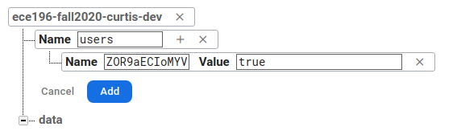
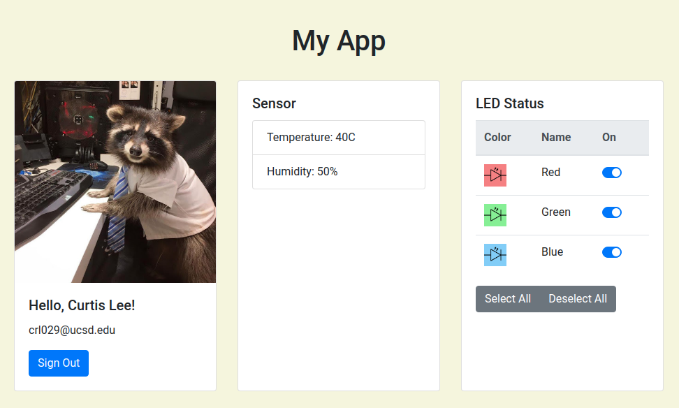

# Intro to Security
_Written by Curtis Lee_

## Firebase Authentication

Designing a login system from scratch would not only be a complete waste of time, but also introduce security liabilities to our system. 

Using Firebase Auth, we can leverage Google's secure system by embedding a Google SSO (Single Sign On) into our app.

### Enable Google Sign In

1. Visit the **Authentication** service section of the Firebase dashboard.
2. Under **Sign-in Providers**, open the **Google** tab and **enable** the service.
3. Under **Authorized domains**, add all the domains that our website is being visited from (including _localhost_ and our Github Pages domain).

### Importing Library

1. Like the other Firebase libraries, we need to include a script for the Auth library.

        

2. After the main `firebase` object is initialized, we want get an `auth` object for convinience.

        auth = firebase.auth()

3. We also may want to set the persistence level to `LOCAL` which allows the user to stay logged in even if the page is closed.

        auth.setPersistence(firebase.auth.Auth.Persistence.LOCAL);

### Adding Functionality

Now we want to add a few extra `data` fields to handle login state:

    data: {
        ...
        signedIn: false,
        email: "none",
    },

Add some extra functions `signIn` and `signOut`. This will launch a pop-up window for Google Sign In, and gracefully end the session if the user explicitly logs out.

    methods: {
        ...
        signIn: function () {
            var provider = new firebase.auth.GoogleAuthProvider();
            auth.signInWithPopup(provider).then(function(result) {
                console.log( "signed in as: "+result.user.email );
            });
        },
        signOut: function () {
            auth.signOut().then(function() {
                console.log( "signed out" );
            });
        },
    },

Add this listener in `created` to handle changes in login. This is the officially recommended way to keep track of login state.

    created: function() {
        ...
        auth.onAuthStateChanged(user => {
            if (user){
                this.signedIn = true;
                this.email = user.email;
            }
            else{
                this.signedIn = false;
                this.email = "none";
            }
        });
    },

At this point our Firebase Authentication system should be fully functional, which we can check by testing `vm.signIn()` and `vm.signOut()` in our browser terminal.

However, the system currently does not actually prevent anyone from accessing our data, which we'll fix next.

### Setting Permissions

One way we can quickly approach this is to list allowed users in our database and add users to the list manually.

First, we should create another database structure to store our list of allowed users.

1. In Firebase Dashboard > **Authentication**, copy the UID of the user you want to allow (ie yourself).
2. In Firebase Dashboard > **Realtime Database** > **Data**
    1. We add a new entry `users`, under the root.
    2. To `users` we add our UID, with the value `true` as a placeholder.
        
    3. We can also add more users if needed.

Next, we need to change the Realtime Database rules, which currently allow public read/write.

1. In Firebase Dashboard, go to **Realtime Database** > **Rules** > **Edit Rules**
2. Replace the rules with something like this:

        {
            "rules": {
                ".read"  : "auth != null && root.child('users').hasChild(auth.uid)",
                ".write" : "auth != null && root.child('users').hasChild(auth.uid)"
            }
        }
    
    This will ensure:

    * User is authenticated
    * User's UID exists in `users`

Now, if we go back to our app, open the Browser Console, when we try to access data we should see an error message of this type:

    Uncaught (in promise) Error: PERMISSION_DENIED: Permission denied

But if we sign in using `vm.signIn()` as an allowed user, then we should be able to access data.

### Changing the UI

At this point we may have realized using the Browser Terminal to authenticate ourselves is not a good user experience. To fix this, we can alter our page using techniques we've already learned to make it more user friendly.

#### State Dependant Page

To start, we should wrap our current page contents in a div, and create another div along side it to hold a future login prompt. We can add `v-show` directives that depend on our state variable `signedIn` to show a login panel if the user is not signed in, or our main page if the user is signed in.

    

        <!-- Login prompt here...     -->
    

    

        <!-- Page contents here...     -->
    

!!! tip
    Although we could certainly use `v-if`, for performance it's technically better practice to use `v-show` for lots of elements. `v-show` simply adds a CSS `hidden` property to the `div`, while `v-if` will require the browser to re-render the contents.

#### Adding Login Buttons

For the login page, we simply copy the header from the main page and add a link-button that will run `signIn()` when clicked:

    
 
        

            

                <h1 id="title">{{ titleText }}</h2>
                
You are not signed in.

                <a class="btn btn-primary" v-on:click="signIn()">Sign In with Google</a>
            

        

    

We can also make similar changes to our main page's header to display the user's email, add a link-button to run `signOut()`, and put a bit of margin for cleanliness:

    
 
        

            

                <h1 id="title">{{ titleText }}</h2>
                
Hello, {{ email }}!

                <a class="btn btn-primary" v-on:click="signOut()">Sign Out</a>
            

        

    

#### Displaying User Info

When a user logs in via Google, a few details are shared with the app:

* Email address
* Full name
* Profile picture

Similar to how we got the user email, we can also display the other items as well.

We can turn our Raspberry Pi card into a user details card like this:

    

        

            
            

                <h5 class="card-title">Hello, {{displayName}}!</h5>
                
{{email}}

                <a class="btn btn-primary" v-on:click="signOut()">Sign Out</a>
            

        

    

!!! info
    We use the `v-bind` directive to bind the `photoURL` variable to the `src` attribute. Using `{{ }}` does not work on HTML attributes, only inner HTML content.

### Allowing Domains

If we access the app on Github Pages, the login popup may not work as expected. By default, Firebase rejects all domains except localhost and their own domain. To solve this, we can add our Github Pages domain:

1. In Firebase Dashboard > **Authorized domains**, click **Add Domain**
2. Add your `[username].github.io` address to the list.