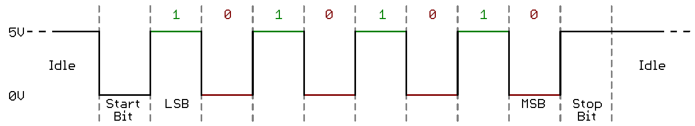
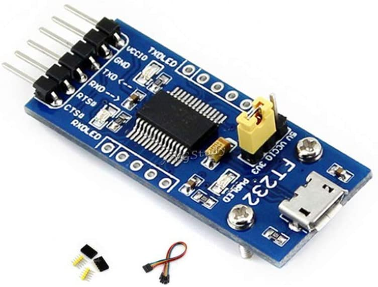
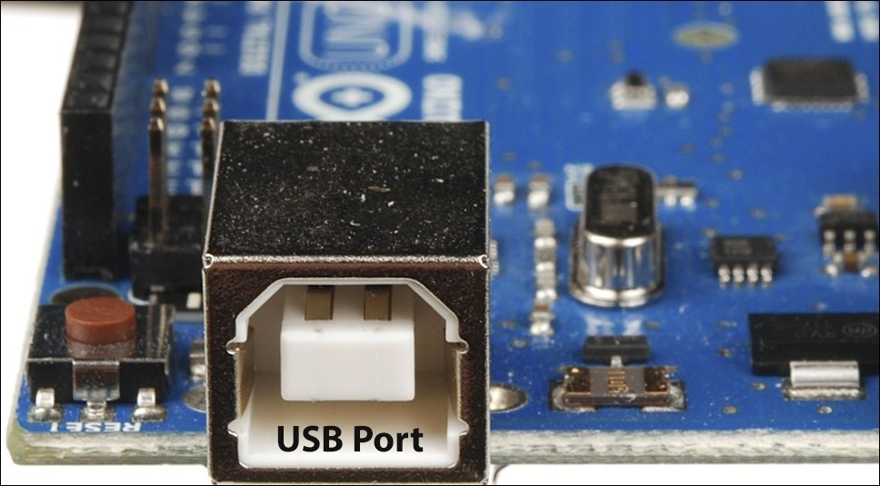
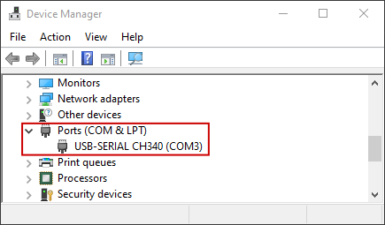
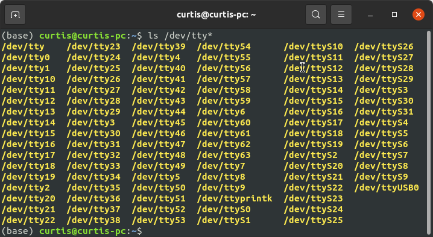
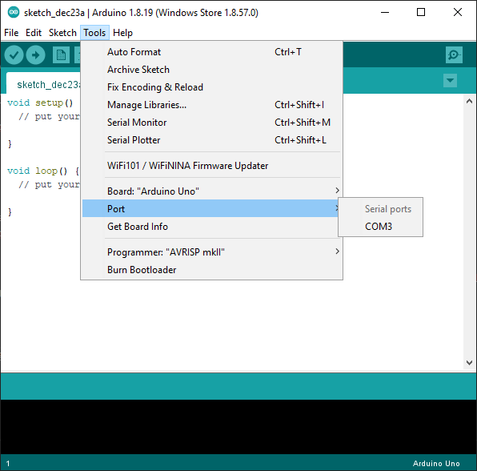
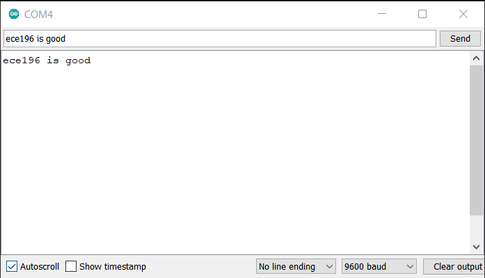
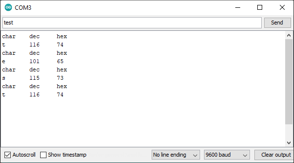
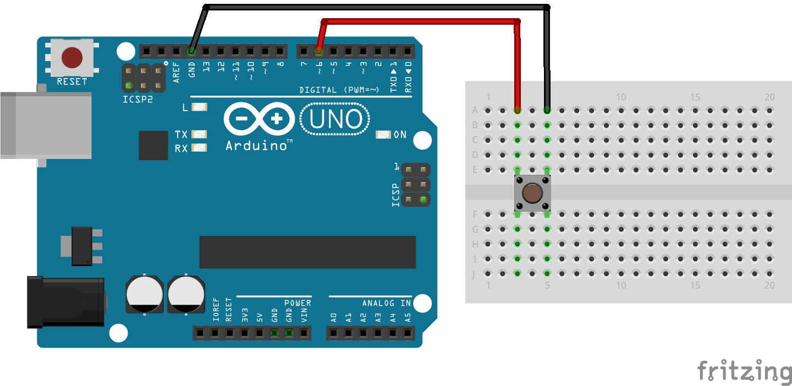

# Intro to UART Serial Communication
_Written by Curtis Lee_

## Motivation

In this article we will learn how UART (Universal asynchronous receiver-transmitter) serial works, and how it can help us construct projects. 

Though it sounds boring there some compelling reason to learn how this works:

* **Helps us connect multiple subsystems together in project:**
    * devices to microcontroller
    * microcontroller to computer
    * wired and wireless connections
* Answer common questions in firmware engineering interview

!!! idea
    Your new project is a real life [Weasley Clock](https://harrypotter.fandom.com/wiki/Weasley_Clock#:~:text=The%20Weasley%20Clock%20was%20a,every%20member%20of%20the%20household.), which is a clock that has motor-driven arms that point at different angles, corresponding to different states.

    

    Your MVP design requires you to connect servo motors to your PC or a Raspberry Pi, neither of which has any ports to connect a servo motor. However, you recall connecting many servos to your old Arduino Uno from ECE5. You propose using your Arduino Uno solely as a motor driver unit for this project. 

    If only there was a way for the computer to tell the Arduino what to do...

For ease of use we will primarily use Arduino IDE and Python in later examples.

## Different Types of Serial Communication

UART is a type of serial communication, but not all serial communications are necessarily UART. There are some other kinds you may encounter in the Arduino ecosystem:

* SPI
    * Synchronous, has a clock pin
    * Need select/control pins to connect multiple devices
* I2C
    * Asynchronous, each device has address
* UART
    * Synchronous, devices need to agree on transfer speed, or baud rate
    * Usually bidirectional, and using two devices
  
In embedded development, both SPI and I2C are used mainly used for sensors, modules, etc and usually already integrated into pre-made libaries for those. 

Usually, UART is usually what people refer to as simply "serial", and is usually the go-to for connecting microcontroller systems together or connecting microcontrollers to a computer. Because of this, **in this tutorial we will focus mainly on UART**. In real life industry, UARTs are used frequently for all kinds of random stuff.

Compared to other protocols, UART is most ideal for ease of use when high data rate or multiple connections are not needed.

For more information on all the protocols and differences between them, check out [this article](https://www.seeedstudio.com/blog/2019/09/25/uart-vs-i2c-vs-spi-communication-protocols-and-uses/).

## How UART Serial works

### Basics

To send data both ways, or bidirectional communication, UART is usually wired up like this:


The RX (recieve) of one device is connected to the TX (tranmit) of the other, and vice versa. Using two wires allows both devices to send and receive independantly of and without interfering of other, also known as *full-duplex mode*.

On the sending device, each data byte is broken up and transmitted one bit at a time, with padding to detect when each bit starts, and sometimes extra bits for additional features. The data is then read and assembled back into bytes on the recieving device.



For more in-depth technical explanation on how it works, check out [this video](https://www.youtube.com/watch?v=sTHckUyxwp8).

### Baud Rates

Since there is no clock signal to synchronize the ups and downs, to ensure both devices can communicate with each other properly, they need to agree upon a fixed rate to send data, known as a **baud rate**. 

Since each of our bits are binary 0's and 1's, we can also consider baud rate equivalent to bit rate.

Some common baud rates include:

* 9600
* 115200

The Arduino serial monitor allows us to pick from preset common baud rates.

### Encoding

By default, usually UART serial handles data in **bytes**. 

Bytes are really just 8-bit binary numbers, or 256 combinations of 1's and 0's, or 0-255 in decimal values.

To represent useful symbols like characters, some kind of encoding is needed. An encoding scheme maps these 0-255 binary values into symbols.

The most universal encoding scheme for bytes is [**ASCII**](https://www.ascii-code.com/). ASCII specifies which byte values correspond to a-z letters, A-Z letters, 0-9 digits, common punctuations marks, and some other features.

A reference for the ASCII table can be [**found here**](https://www.ascii-code.com/).

### Line Termination

These characters come from typewriter era and have special ASCII values:

* `\n` is new line character, this is supposed to make the cursor move down one line.
* `\r` is carriage return character, this supposed to make the cursor jump to the start of the line.

These days in most terminals, just `\n` is enough to make the cursor move to the *start of next line*, like hitting the `Enter` key into a text editor. On some systems, `\r\n` is preferred, particularly on Windows applications. 

The Arduino serial monitor also allows us to choose which line termination to use.

### Common USB-UART Adapters
There are some common cheap module boards out there that have Serial UART pins and accept a USB connection. Some are also built-in to cheap Arduino boards. 

These adapters allow us to connect a device with USB ports, like a computer, to some kind of embedded device or project.

Usually they are based on one of these common chipsets. Some might require driver installation to work on some operating systems:

* Official Arduino Serial Chip
    * Built-in to most "official design" Arduino boards
    * Should "just work" on all systems
* FTDI FT232 Series
    * Most universally compatible chipset, but slightly more expensive
    * Should "just work" on all systems
* CH340 Series
    * If if doesn't work, install [Drivers](https://learn.sparkfun.com/tutorials/how-to-install-ch340-drivers/all)
* PL2303 Series
    * If if doesn't work, install [Drivers](http://www.prolific.com.tw/US/ShowProduct.aspx?p_id=225&pcid=41)
* CP2102 Series
    * If if doesn't work, install [Drivers](https://www.silabs.com/developers/usb-to-uart-bridge-vcp-drivers) 

| |  |
|:--------------:|:-----------:|
| FTDI module with micro USB connector | Arduino Uno has bulit-in adapter with USB B-type connector |

## Checking device connection

On the computer, there are some ways to check if the device is properly detected before doing anything. This is useful during troubleshooting.

#### Windows

1. Open *Device Manager*
2. If successful, under *Ports* there will be an entry for the device, associated with a COM number.

    

3. To connect to the device later, keep track of the COM number.

#### Mac/Linux

1. Open a terminal
2. type `ls /dev/tty*`
3. Usually at the very end there will appear a *ttyUSB* with a number.

    

4. To connect to the device later, keep track of the path to the device.

!!! tip
    In any operating system, if you're not sure which one is the correct device, or if it's even appearing up at all, you can try unplugging and replugging the USB Serial device and monitoring what changed in the listings each time.

## Opening a serial window

When a serial device is connected to the computer, a serial terminal is software that shows a window to let us see what is being recieved, as well as send data back by typing with the keyboard. Some applications may be designed to be used over terminal like this, but in most situations, this is still extremely useful for debugging and making sure that the connection works.

The easiest way to get started is using Arduino IDE. Under *Tools > Port* select the correct device found earlier. Usually there will only be one entry, or it will be obvious which is correct, unless you have many serial devices attached to the computer for some reason.

Then open *Serial Monitor*.



On an "empty" Arduino this probably won't do anything, so first we need to upload a sketch that will help us test the connection by sending some sort of feedback.

## Example Arduino sketches

To run these examples, set the serial monitor baud rate to the appropriate value of 9600.

### Serial Echo

This example should take whatever you enter into the terminal and echo it right back.

```
void setup() {
  Serial.begin(9600);
}

void loop() {
  if (Serial.available()) {
    char c = Serial.read(); // save incoming data into c
    Serial.write(c); // send c right back
  }
}
```



If you see some onboard LEDs on the Arduino flashing, and whatever you type into the input appear in the window, it's probably working.

### Byte Information

This example should take characters entered into the terminal and display it as different representations.

```
void setup() {
  Serial.begin(9600);
}

void loop() {
  if (Serial.available()) {
    char c = Serial.read(); // save incoming data into c
    Serial.print("char\tdec\thex\n"); // print info
    Serial.print(c); // print c as char
    Serial.print('\t');
    Serial.print(c, DEC); // print as decimal value
    Serial.print('\t');
    Serial.print(c, HEX); // print as hexidecimal value
    Serial.print('\n'); // print newline (as seperator)
  }
}
```



### Turn on/off LED 

We can also write code to do different things based on what input was received and make a simple terminal application:

```
void setup() {
  Serial.begin(9600);
  pinMode(LED_BUILTIN, OUTPUT);
}

void loop() {
  if (Serial.available()) {
    char c = Serial.read(); // save incoming data into c
    if (c == 'a'){
       Serial.println("LED ON");
       digitalWrite(LED_BUILTIN, HIGH); // turn the LED on
    }
    else if (c == 'x'){
       Serial.println("LED OFF");
       digitalWrite(LED_BUILTIN, LOW); // turn the LED off
    }
    else{
      Serial.println("unknown command");
    }
  }
}
```

This example should read the input, and turn on or off the Arduino bulit-in LED (wired to pin 13) if it recieved `a` or `x` respectively.

`a` and `x` are picked arbitrarily, you can replace them with whatever symbols you want and it should still work.

<iframe width="1520" height="545" src="https://www.youtube.com/embed/unkKMxFdNXk" title="YouTube video player" frameborder="0" allow="accelerometer; autoplay; clipboard-write; encrypted-media; gyroscope; picture-in-picture" allowfullscreen></iframe>

### Decoding numbers

Previously we learned about ASCII encoding. When we type characters into the terminal we are actually sending ASCII encoded characters. 

If we type strings like `78` into the terminal, we aren't actually sending the byte value of `78`, but actually bytes `58` and `59` corresponding to ASCII representation of `7` and `8`. This sequence would need to be decoded to obtain a numerical `int` value in the Arduino. 

Luckily, Arduino provides a straightforward `Serial.parseInt()` to handle this conversion for us, although it may run a bit slow. Otherwise we would have to use C tricks to parse the input properly.

```
void setup() {
  Serial.begin(9600);
  pinMode(LED_BUILTIN, OUTPUT);
}

unsigned long currentTime = 0;
unsigned long lastTime = 0;
unsigned long interval = 100;
bool ledState = LOW;

void loop() {

  currentTime = millis();
  if (currentTime - lastTime > interval){
    lastTime = currentTime;
    ledState = !ledState; // toggle the LED
    digitalWrite(LED_BUILTIN, ledState);
  }
  
  if (Serial.available()) {
    // use Arduino built-in function to convert the input to int
    // note: may be slow
    int value = Serial.parseInt(); 
    Serial.println(value);
    if (value > 0 && value < 1000){
      interval = value; // set the interval time to the entered value
    }
  }
}
```
<iframe width="1520" height="545" src="https://www.youtube.com/embed/XtCHegxXmVM" title="YouTube video player" frameborder="0" allow="accelerometer; autoplay; clipboard-write; encrypted-media; gyroscope; picture-in-picture" allowfullscreen></iframe>

!!! note
    This example [blinks the LED without using `delay()`](https://www.arduino.cc/en/Tutorial/BuiltInExamples/BlinkWithoutDelay). While not strictly necessary in this case, it is generally better practice to, especially if we end up handling multiple tasks at once, since `delay()` pauses the Arduino from doing anything. [More explanation can be found here](https://www.gammon.com.au/blink). 
    
    `delay()` also stops the Arduino from processing incoming serial data. However, there is a serial *buffer* that temporarily stores some incoming data, so it may be processed after the `delay()` is over. Nevertheless, it is still best practice to avoid `delay()` whenever possible to achieve faster response time and prevent the buffer from overflowing, which would result in lost data. These examples will avoid `delay()` whenever possible.

## Python Pyserial examples

For these example we need to first install `pyserial` package in python so it can open serial port.

```
python3 -m pip install pyserial
```

### Serial Echo

To get started and make sure everything works, we can replicate the behavior of the Arduino serial monitor using Python. Recall from earlier example from [Serial Echo](#serial-echo), the Arduino sketch reads data from serial and echos it back to the computer. With this following Python script, we can enter bytes and read the response.

Note that `com_port` in this and all following examples will also need to be replaced with the address of your current device. (COM4 is just an example)

```
import serial
import time

com_port = 'COM4'
arduino = serial.Serial(port=com_port, baudrate=9600, timeout=0.1)

while True:
    tx_data = input("Enter something: ") # Taking input from user
    arduino.write(bytes(tx_data, 'utf-8')) # need to encode utf-8 into ascii
    rx_data = arduino.readline()
    print(rx_data) # printing the value
```

<iframe width="1520" height="545" src="https://www.youtube.com/embed/PDQUIaUJ43E" title="YouTube video player" frameborder="0" allow="accelerometer; autoplay; clipboard-write; encrypted-media; gyroscope; picture-in-picture" allowfullscreen></iframe>

### Button Press

To do more interesting things, we can wire a button up to pin 6 on the Arduino, read the button presses, and send something over serial when the button is pressed.



This following Arduino sketch will read button presses, debounce them, and send a character `x` over serial.
```
// constants won't change. They're used here to set pin numbers:
const int buttonPin = 6;    // the number of the pushbutton pin

// Variables will change:
int buttonState;             // the current reading from the input pin
int lastButtonState = LOW;   // the previous reading from the input pin

unsigned long lastPressTime = 0;  // the last time the output pin was toggled
unsigned long debounceDelay = 50;    // the debounce time; increase if the output flickers

void setup() {
  Serial.begin(9600);
  
  pinMode(buttonPin, INPUT_PULLUP);
}

void loop() {
  int reading = digitalRead(buttonPin);

  if (reading != lastButtonState) {
    unsigned long currentTime = millis();
    if ((currentTime - lastPressTime) > debounceDelay) {
      lastPressTime = currentTime;
      if (reading != buttonState) {
        buttonState = reading;
        if (buttonState == LOW) {
          // button is pressed
          Serial.write('x');
        }
      }
    }
  }
  
  lastButtonState = reading;
}
```

!!! note
    In this example we are using a timer and some extra logic to debounce the button, which is outside the scope of the guide. [See this page](http://www.gammon.com.au/switches) to learn more about debouncing.


Then, this Python script here will read the incoming `x` when the button is pressed and display some feedback in the terminal.

```
import serial
import time

com_port = 'COM4'
arduino = serial.Serial(port=com_port, baudrate=9600, timeout=0.1)

while True:
    rx_data = arduino.readline()
    if rx_data:
        print(rx_data) # printing the value
        if rx_data == b'x':
            print('Button was pressed !')
    time.sleep(0.01) # slight delay to not hog cpu
```

<iframe width="1520" height="545" src="https://www.youtube.com/embed/O8KcP0TUVOM" title="YouTube video player" frameborder="0" allow="accelerometer; autoplay; clipboard-write; encrypted-media; gyroscope; picture-in-picture" allowfullscreen></iframe>

### Simulate Keyboard

To actually do something useful with the button, one thing we can do is mimic keyboard presses. The Python libaray [PyAutoGUI](https://pyautogui.readthedocs.io/en/latest/#) lets us do things like mimic a mouse and keyboard with Python code. 

First we need to install the libary:

```
python3 -m pip install pyautogui
```

Then we can modify the Python script from above to do a `pyautogui.write()` to type out a phrase:

```
import serial
import time
import pyautogui

arduino = serial.Serial(port='/dev/ttyUSB0', baudrate=9600, timeout=0.1)

while True:
    rx_data = arduino.readline()
    if rx_data:
        print(rx_data) # printing the value
        if rx_data == b'x':
            print('Button was pressed !')
            pyautogui.write('Hello world!')
    time.sleep(0.01)
```

<iframe width="1520" height="545" src="https://www.youtube.com/embed/wyVYlUf7qn8" title="YouTube video player" frameborder="0" allow="accelerometer; autoplay; clipboard-write; encrypted-media; gyroscope; picture-in-picture" allowfullscreen></iframe>

## Wireless serial

There are even several solutions out there to get a serial link over wireless. Most can be found in the form of convinient and relatively inexpensive modules:

* [Bluetooth Module](https://www.mrswirlyeyes.com/tutorials/bluetooth_hm_10)
* [HC-15](https://www.allaboutcircuits.com/projects/understanding-and-implementing-the-hc-12-wireless-transceiver-module/)