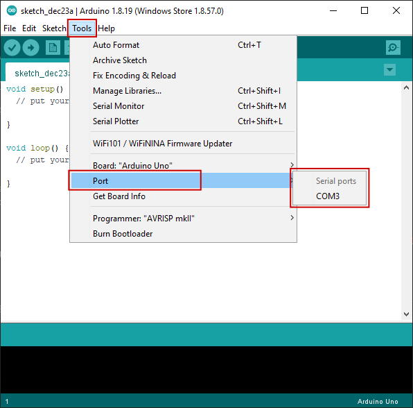

# Intro to Serial Communication
_Written by Curtis Lee_

## Motivation
* Helps us connect multiple systems together
    * devices to microcontroller
    * microcontroller to computer
* "UART vs SPI vs I2C" is common interview question

## Main types of Serial Communication
* SPI
    * Synchronous, has a clock pin
    * Need select/control pins to connect multiple devices
* I2C
    * Asynchronous, each device has address
* UART
    * Synchronous, devices need to agree on transfer speed, or baud rate
    * Usually bidirectional, and using two devices
  
In embedded development, both SPI and I2C are used mainly used for sensors, modules, etc and usually already integrated into pre-made libaries for those. 

UART is usually what people refer to as simply "serial", and is usually the go-to for connecting microcontroller systems together or connecting microcontrollers to a computer. Because of this, **in this tutorial we will focus mainly on UART**.

For more information on all the protocols and differences between them, check out [this article](https://www.seeedstudio.com/blog/2019/09/25/uart-vs-i2c-vs-spi-communication-protocols-and-uses/).

## How UART Serial works

### Basics

To send data both ways, or bidirectional communication, UART is usually wired up in *full-duplex mode* like this:


The RX (recieve) of one device is connected to the TX (tranmit) of the other, and vice versa.

On the sending device, each data byte is broken up and transmitted one bit at a time, with padding to detect when each bit starts, and sometimes extra bits for additional features. The data is then read and assembled back into bytes on the recieving device.


### Common USB-UART Adapters
There are some common cheap module boards out there that have Serial UART pins and accept a USB connection. Some are also built-in to cheap Arduino boards.

Usually they are based on one of these common chipsets. Some might require driver installation to work on some operating systems:

* Official Arduino Serial Chip
    * Built-in to most "official design" Arduino boards
    * Should "just work" on all systems
* FTDI FT232 Series
    * Most universally compatible chipset, but slightly more expensive
    * Should "just work" on all systems
* CH340 Series
    * If if doesn't work, install [Drivers](https://learn.sparkfun.com/tutorials/how-to-install-ch340-drivers/all)
* PL2303 Series
    * If if doesn't work, install [Drivers](http://www.prolific.com.tw/US/ShowProduct.aspx?p_id=225&pcid=41)
* CP2102 Series
    * If if doesn't work, install [Drivers](https://www.silabs.com/developers/usb-to-uart-bridge-vcp-drivers) 

### Checking device connection

On the computer, there are some ways to check if the device is properly detected before doing anything. This is useful during troubleshooting.

#### Windows

1. Open *Device Manager*
2. If successful, under *Ports* there will be an entry for the device, associated with a COM number.

    

3. To connect to the device later, keep track of the COM number.

#### Mac/Linux

1. Open a terminal
2. type `ls /dev/tty*`
3. Usually at the very end there will appear a *ttyUSB* with a number.
4. To connect to the device later, keep track of the path to the device.

!!! tip
    In any operating system, if you're not sure which one is the correct device, or if it's even appearing up at all, you can try unplugging and replugging the USB Serial device and monitoring what changed in the listings each time.

### Baud Rates

To ensure both devices can communicate with each other properly, they need to agree upon a fixed rate to send data, known as a **baud rate**. 

Since each of our bits are binary 0's and 1's, we can also consider baud rate equivalent to bit rate.

Some common baud rates include:

* 9600
* 115200

The Arduino serial monitor allows us to pick from preset common baud rates.

### Encoding

By default, usually UART serial handles data in **bytes**. 

Bytes are really just 8-bit binary numbers, or 256 combinations of 1's and 0's, or 0-255 in decimal values.

To represent useful symbols like characters, some kind of encoding is needed. An encoding scheme maps these 0-255 binary values into symbols.

The most universal encoding scheme for bytes is [**ASCII**](https://www.ascii-code.com/). ASCII specifies which byte values correspond to a-z and A-Z letters, 0-9 digits, common punctuations marks, and some other features.

A reference for the ASCII table can be [**found here**](https://www.ascii-code.com/).

### Line Termination Characters

These characters come from typewriter days and have special ASCII values:

* `\n` is new line character, this is supposed to make the cursor move down one line.
* `\r` is carriage return character, this supposed to make the cursor jump to the start of the line.

These days in most terminals, just `\n` is enough to make the cursor move to the *start of next line*, like hitting the `Enter` key into a text editor. On some systems, `\r\n` is preferred, particularly on Windows applications. 

The Arduino serial monitor also allows us to choose which line termination to use.

## Opening a serial window

The easiest way to get started is using Arduino IDE. Under *Tools > Port* select the correct device found earlier. Usually there will only be one entry, or it will be obvious which is correct, unless you have many serial devices attached to the computer for some reason.

Then open *Serial Monitor*.



On an "empty" Arduino this probably won't do anything, so we need to upload a sketch that will help us test the connection by sending some sort of feedback.

## Example Arduino sketches

To run these examples, set the serial monitor baud rate to the appropriate value of 9600.

### Serial Echo

This example should take whatever you enter into the terminal and echo it right back.

```
void setup() {
  Serial.begin(9600);
}

void loop() {
  if (Serial.available()) {
    char c = Serial.read(); // save incoming data into c
    Serial.write(c); // send c right back
  }
}
```

### Byte Information

This example should take characters entered into the terminal and display it as different representations.

```
void setup() {
  Serial.begin(9600);
}

void loop() {
  if (Serial.available()) {
    char c = Serial.read(); // save incoming data into c
    Serial.print("char\tdec\thex\n"); // print info
    Serial.print(c); // print c as char
    Serial.print('\t');
    Serial.print(c, DEC); // print as decimal value
    Serial.print('\t');
    Serial.print(c, HEX); // print as hexidecimal value
    Serial.print('\n'); // print newline (as seperator)
  }
}
```


### Turn on/off LED 

We can also write code to do different things based on what input was received and make a simple terminal application:

```
void setup() {
  Serial.begin(9600);
  pinMode(LED_BUILTIN, OUTPUT);
}

void loop() {
  if (Serial.available()) {
    char c = Serial.read(); // save incoming data into c
    if (c == 'a'){
       Serial.println("LED ON");
       digitalWrite(LED_BUILTIN, HIGH); // turn the LED on
    }
    else if (c == 'x'){
       Serial.println("LED OFF");
       digitalWrite(LED_BUILTIN, LOW); // turn the LED off
    }
    else{
      Serial.println("unknown command");
    }
  }
}
```

This example should read the input, and turn on or off the Arduino bulit-in LED (wired to pin 13) if it recieved `a` or `x` respectively.

### Decoding numbers

Previously we learned about ASCII encoding. When we type characters into the terminal we are actually sending ASCII encoded characters. 

If we want to send the Arduino numberical value by typing strings like `78` into the terminal, we aren't actually sending the byte value of `78`, but actually bytes `58` and `59` corresponding to ASCII representation of `7` and `8`. This sequence would need to be decoded to obtain a numerical `int` value in the Arduino. 

Luckily, Arduino provides a straightforward `Serial.parseInt()` to handle this conversion for us, although it may run a bit slow. Otherwise we would have to use C tricks to parse the input properly.

```
void setup() {
  Serial.begin(9600);
  pinMode(LED_BUILTIN, OUTPUT);
}

unsigned long currentTime = 0;
unsigned long lastTime = 0;
unsigned long interval = 100;
bool ledState = LOW;

void loop() {

  currentTime = millis();
  if (currentTime - lastTime > interval){
    lastTime = currentTime;
    ledState = !ledState; // toggle the LED
    digitalWrite(LED_BUILTIN, ledState);
  }
  
  if (Serial.available()) {
    // use Arduino built-in function to convert the input to int
    // note: may be slow
    int value = Serial.parseInt(); 
    Serial.println(value);
    if (value > 0 && value < 1000){
      interval = value; // set the interval time to the entered value
    }
  }
}
```
