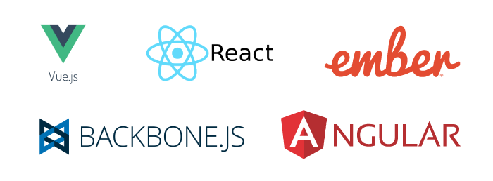

# Intro to Frontend Development
_Written by Curtis Lee_

The modern World Wide Web is truly a world of chaos and anarchy, with competing powers rising and falling, along with their preferred way of doing things. Brought to you by your favorite web browser!

## Fundamentals

The most fundamental concepts of Web Development essentially boil down to these three (3):

1. **HTML**
    * The most basic building blocks of a webpage.
    * Most atomic elements are various "tags" containing information.
    * Tags can have attributes to assign special characteristics or functionality to them.
    * Tags can be nested.
    * The browser reads all these tags and builds a DOM (Document Object Model)
    * Example:
            
            <html>
                <body>
                    <h1 id="title">I am a title font!</h2>
                    
I am a paragraph of content!

                </body>
            </html>

2. **CSS**
    * Tells the browser how to render the website.
    * Makes it look good!
    * Defined by "selecting" specific HTML tags and setting styling attributes to them.
    * Tells the browser how to render elements of the DOM.
    * Example:

            body {
                background-color: beige;
                text-align: center;
            }

3. **JavaScript**
    * JavaScript is **NOT Java**.
    * Makes the website come alive!
    * Can manipulate HTML elemeents in the DOM.
    * Pieces of software (programming) that runs in the browser.
    * Example:

            document.getElementById("title").innerHTML = "Hello JavaScript!";

!!! info
    For more guides and references to HTML, CSS, and JS stuff, a good resource is [w3schools.com](https://www.w3schools.com/)

#### Getting Started

!!! info
    [Click here](https://github.com/ucsd-ece196/ucsd-ece196.github.io/tree/main/examples/html) to download starter code examples for this guide.

Starting an HTML document from scratch is fairly straightforward. 

1. Create a new folder for your project.
2. In the folder, create a empty text file named `index.html` and open it in VS Code.
3. By copying and pasting the examples shown previously, adding some extra tags, we can make this:
    
        <!DOCTYPE html>
        <html>
            <head>
                <title>My App</title>
            </head>
            
            <body>
                <h1 id="title">I am a title font!</h2>
                
I am a paragraph of content!

            </body>
            
        </html>

We can now open the file with a web browser to see the results.

Notice:

* The background of the page is colored beige, and the text is centered on the page. This is consistent with the CSS styling we specified.
* The big `<h1>` text shows "Hello JavaScript", which is not the original text, but rather set by our JavaScript script. If we remove that JavaScript snippet from our page, this will no longer happen.

### Modifying Code

We can also create more interesting behavior by changing the JavaScript. Try replacing the code in the `

Since the browser loads the DOM in order, we must place this before we write any Javascript code that uses Vue. The best place in our current page is after `<body>` but before `
    ...

Note: we can remove the JavaScript code from the previous section.

### One-Way Data Binding
To witness the full power of Vue, we can set up what's called a data binding:

1. Change the text in our `<h1>` to `{{ titleText }}`.
2. Add a string `titleText` to data.

Our code now:

    ...
    <body>
        

            <h1 id="title">{{ titleText }}</h2>
            
I am a paragraph of content!

        

    </body>
    ...
    
    ...

Now if we refresh the page we should see that Vue changes the `titleText` into what we specified!

!!! tip
    Another useful perk of Vue is how easy it is to debug our application with the built-in browser Console. To open the console in Chrome, we can open Developer Tools or press `F12` and click the Console tab.

    Our data fields are all properties of the Vue object, and since our Vue object is called `vm`, we can address `titleText` as `vm.titleText`

    1. Try typing `vm.titleText` into the console. What does it output? is this expected?
    2. Try typing `vm.titleText = 'ECE 196'` into the console. Now look at the HTML page. What is the `<h1>` text now? 

One of the most powerful advantages of Vue data binding is how values in the HTML and JavaScript portions of our webpage are seamlessly connected, in real time.

If we wanted to achieve the same with pure JavaScript, it would not only   take much more time writing and debugging more code, but the complexity would also grow exponentially when we add more stuff to our webpage. 

### Two-Way Data Binding

We just saw how to get Vue to put variables into HTML, but we also want to be able to put HTML variables into Vue. One way to do this is with two-way data binding.

Before we do that, we need to create something in HTML designed to handle user input. One type of common input is the checkbox. We can add three checkboxes to the page like this:

    <label>
        <input type="checkbox" v-model="color.r"> Red
    </label>
    <label>
        <input type="checkbox" v-model="color.g"> Green
    </label>
    <label>
        <input type="checkbox" v-model="color.b"> Blue
    </label>

Next we want to declare variables in Vue for these values to go. One way we can do this is to add a dictionary under `data` with 3 boolean values like this:

    data: {
        ...
        color: {
            r: false,
            g: false,
            b: false
        }
    },

If we refresh the page, we should see our three checkboxes appear. 

!!! tip
    To verify that everything works we can use the console again:

    1. Tick an arbitrary combination of the boxes on our page
    2. type `vm.color` in the browser console 
    3. expand the `Observer` object 
    4. click each color field to load the value

    Is this what we'd expect?

To make things really interesting we can reflect the values back onto our HTML page. Under the checkboxes, we can add another `
` like this:

    
Selected Values: {{ color }}

When the boxes are ticked, we can see the dictionary updated automatically on our page!

### Directives

Directives are special HTML tag attributes that define behavior in Vue but are otherwise ignored by the browser.

As you may have noticed in the previous section, we used the `v-model` directive to tell Vue that we want two-way data binding on our checkbox values.

There are a multitude of other directives in Vue to accomplish all kinds of tasks, but we will only use a few ones here:

* `v-model` - creates two way data-binding
* `v-if` - displays an element only if the condition is true
* `v-else` - compliment for `v-if`
* `v-on:change` or `@change` - runs a function when the element is changed
* `v-on:click` or `@click` - runs a function when the element is clicked

To see these in action, we can create some more HTML elements with Vue directives. Replace:

    
Selected Values: {{ color }}

with this:

    <button type="button" v-on:click="selectAll(true)">Select All</button>
    
Selected Values: {{ color }} 

    
No colors are selected.

And in our Vue object, add a method called `selectAll()` that takes a parameter `value` like this:

    methods: {
        selectAll: function(value) {
            this.color.r = value;
            this.color.g = value;
            this.color.b = value;
        }
    }

!!! info
    Since `color` is a field of `vm`, and the function runs within `vm`'s scope, we reference `color` as `this.color`

Now when we refresh the page, we should see:

1. Two-way data binding on the checkboxes still works.
2. Different `
` element is shown if no checkboxes are ticked.
3. Clicking the button will run a function that ticks all the checkboxes.

## Connecting to Firebase

This sections assumes we already have a Firebase app set up.

### Adding Firebase

To include the Firebase Core and Realtime Database libraries on our webpage, we can add the following lines similar to including the Vue library:

    
    

Now outside and before our `vm = new Vue()` object, we need to initialize our objects called `firebase` and `database`:

    var firebaseConfig = {
        ...
    };
    firebase.initializeApp(firebaseConfig);
    database = firebase.database()

    var vm = new Vue({
        ...
    
Replacing `firebaseConfig` with the one given in our Firebase App dashboard.

!!! info
    It's possible to put the Firebase objects within our Vue object, but for our purposes it's easier to leave them seperate.

### Reading Data

To read color data from Firebase, lets first add a new method in our Vue called `setupColorListener()`. This will create a listener in the background of our web app that listens for any changes in our database entry, and runs a function every time Firebase sends us these changes.

    setupColorListener: function() {
        var colorDataRef = database.ref('path/to/ref');
        colorDataRef.on('value', function(snapshot) {
            vm.color = snapshot.val();
        }); 
    },

But note that so far our Firebase data is structured like this:

Therefore, if we want the color data, our reference path should be changed to `'data/color'`, which gives us:

    var colorDataRef = database.ref('data/color');

!!! info
    The callback function explicitly references `color` as `vm.color` and not `this.color`. This is because the callback is actually run within the Firebase object, which is outside the scope of `vm`.

And we want the function to be run as soon as the page loads. So it makes sense to call the function under our `created` initialization function:

    created: function() {
        this.setupColorListener();
    },

In Firebase Dashboard, if we now change the values within `color`, we should now see them update the checkboxes on our page, in real time!

### Writing Data

While we can recieve data from Firebase, we also want changes to the checkboxes to also be sent to Firebase. This can be done with the `v-on:change` directive.

Start by adding a new method called `updateColor()` in our Vue's methods:

    updateColor: function() {
        database.ref('data/color').set(this.color);
    }

Next we want to enclose the checkboxes into a new form element with the directive like this:

    <form v-on:change="updateColor()">
        <label>
            <input type="checkbox" v-model="color.r"> Red
        </label>
        <label>
            <input type="checkbox" v-model="color.g"> Green
        </label>
        <label>
            <input type="checkbox" v-model="color.b"> Blue
        </label>
    </form>

Similarily, we want to add an `v-on:click` directive to the button as well:

    <button type="button" v-on:click="selectAll(true); updateColor()">Select All</button>

Every time Vue detects a change in the `<form>` containing all the checkboxes, it will run the function that submits the changed `color` dictionary.

If we tick/untick any of the checkboxes, we should also be able to now see the values get updated in Firebase Dashboard as well!

## Intro to CSS

There are two main ways to fine-tune the way our HTML elements look.

1. The `class` attribute
    * By assigning our element to a `class` value defined in `

        We see that:

        * The background color is changed to `lightblue`
        * Everything reverts back to being left aligned, which is the default.

2. The `style` attribute
    * Can also inject some CSS properties directly into the tag.
    * For very minor finer-tuning.
    * For example this will center all the text inside the `
`:

            

                I am centered text.
            

        

            I am centered text.
        

### Fixing Loading Glitches 

When we refresh the page, sometimes we can still see `{{ }}` in the HTML before Vue loads. We can actually use a special Vue directive `v-cloak` along with some simple CSS to fix this.

Add this to the style block:

    [v-cloak] {
        display: none;
    }

And also add the directive onto the main `
` of the app:

    

Now the page will no longer flash those `{{ }}` before Vue loads.

### Changing Font Size

For individual elements, we can change the font size using either method.

To specify font size, we use the CSS property `font-size` plus [some kind of CSS unit](https://www.w3schools.com/cssref/css_units.asp). 

One popular unit is the `em`, which is based on the default font size in that element. For example, `3em` means 3 times the font size.

1. Using `class` attribute:

        

    <!-- tsk -->

        
 
            25C 
        

2. Using `style` attribute:

        
 
            25C 
        

Both should produce the same result:

    
 
        Temperature: 
    

    
 
        25C 
    

### Bootstrap

At this point you may have noticed our website overall still looks pretty unattractive. We could write more CSS from scratch to make our website look exactly how we want, but in most cases that's a waste of time. Instead, we can use another framework for CSS called Bootstrap. 

[See Bootstrap Section](../bootstrap){: .md-button }

## Hosting on Github Pages

!!! info
    Follow [this tutorial](https://www.mrswirlyeyes.com/tutorials/introduction_to_git_github) (30min) to learn how to use Git and Github. [Follow GitHub Pages guide here](https://pages.github.com/). Project site is recommended, but you can also create a profile site.

1. Create a new repository on the Github website.
2. In the repository's **Settings** > **GitHub Pages** select the primary branch as **Source**.
3. Copy the git ssh url.
4. Open terminal in project folder and enter the following commands:
5. `git init`
6. `git remote add origin <git ssh url here>`
7. `git add .`
8. `git commit -m first commit!`
9. `git push`

!!! tip
    To upload updated code, repeat steps 7-9 and replace "first commit!" with a brief description of the new changes. Also, Git may require you to set an upstream (follow instructions onscreen) on the first push.

Ensure the html page is called `index.html`. 

Then navigate to `yourusername.github.io/reponame` to view your website.

## Conclusion

The content in this guide is by no means all-inclusive. In fact, we barely scratched the surface of what these frameworks have to offer.

For more features and help it's definitely worth looking at the documentation these products.